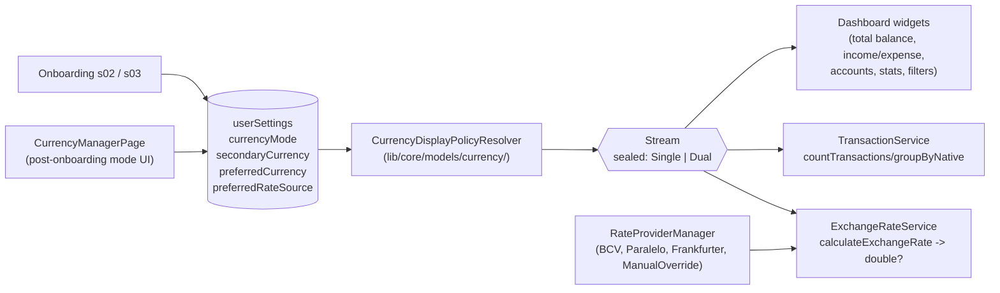
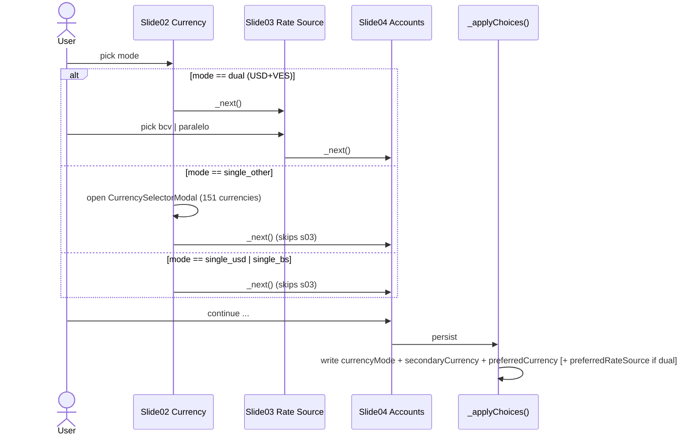

# Design: Currency Modes Rework

Per `openspec/config.yaml` rules: feature-first (`lib/app/{feature}/`), shared in `core/`, sequence diagrams for complex flows, decisions with rationale.

## 1. Architecture overview



The pipeline is one-directional: **settings → resolver → policy stream → consumers**. All UI components stop reading raw setting keys and consume `CurrencyDisplayPolicy` instead. The policy is the single source of truth for "should I render two lines? show the BCV chip? what currency is the equivalence in?".

## 2. Data model

### Drift schema delta

`exchangeRates.source` is already nullable TEXT — **no DDL change**. `userSettings` is key/value — **no DDL change**. We add two new `SettingKey` enum values:

```dart
// lib/core/database/services/user-setting/user_setting_service.dart
enum SettingKey {
  // ... existing values
  currencyMode,        // 'single_usd' | 'single_bs' | 'single_other' | 'dual'
  secondaryCurrency,   // ISO code or NULL
}
```

### Migration (one-shot, idempotent, runs on first cold start of new build)

```sql
-- A. Seed currencyMode if missing — heuristic uses preferredRateSource as the dual signal.
INSERT OR IGNORE INTO userSettings (settingKey, settingValue)
SELECT 'currencyMode',
       CASE
         WHEN EXISTS (SELECT 1 FROM userSettings WHERE settingKey='preferredRateSource')
              THEN 'dual'
         WHEN (SELECT settingValue FROM userSettings WHERE settingKey='preferredCurrency')='USD'
              THEN 'single_usd'
         WHEN (SELECT settingValue FROM userSettings WHERE settingKey='preferredCurrency')='VES'
              THEN 'single_bs'
         ELSE 'single_other'
       END;

-- B. Seed secondaryCurrency only for dual users.
INSERT OR IGNORE INTO userSettings (settingKey, settingValue)
SELECT 'secondaryCurrency',
       CASE
         WHEN EXISTS (SELECT 1 FROM userSettings WHERE settingKey='preferredRateSource')
              THEN 'VES'
         ELSE NULL
       END;
```

### `ExchangeRateInDB.source` — confirmed lowercase

Existing rows are lowercase (`'bcv'`, `'paralelo'`). We keep lowercase. Valid values:

| value | meaning |
|---|---|
| `bcv` | Banco Central de Venezuela (DolarApiProvider) |
| `paralelo` | Tasa paralelo (DolarApiProvider) |
| `auto_frankfurter` | api.frankfurter.app (ECB-backed) |
| `manual` | User-entered override |

Note: `transactions.exchangeRateSource` already has a `CHECK` for `('bcv','paralelo','manual','auto')`. We will widen this in a follow-up Drift migration to `('bcv','paralelo','auto_frankfurter','manual')` if needed; for now `'auto'` is treated as legacy alias for `'auto_frankfurter'` at the Dart layer.

### Dart enums

```dart
// lib/core/models/currency/currency_mode.dart
enum CurrencyMode { single_usd, single_bs, single_other, dual }

// lib/core/services/rate_providers/rate_source.dart
enum RateSource {
  bcv('bcv'),
  paralelo('paralelo'),
  autoFrankfurter('auto_frankfurter'),
  manual('manual');
  final String dbValue;
  const RateSource(this.dbValue);
}
```

## 3. The `CurrencyDisplayPolicy` abstraction

Lives in `lib/core/models/currency/currency_display_policy.dart`. Built on Dart 3 sealed classes (already used elsewhere in the project per the `freezed` dep, but we use plain sealed for zero codegen).

```dart
sealed class CurrencyDisplayPolicy {
  const CurrencyDisplayPolicy();

  const factory CurrencyDisplayPolicy.single({required String code}) = SingleMode;
  const factory CurrencyDisplayPolicy.dual({
    required String primary,
    required String secondary,
  }) = DualMode;

  /// Currencies the user wants to *see* on the dashboard.
  List<String> displayCurrencies();

  /// True when the policy is dual AND the pair is exactly USD+VES.
  /// Drives the BCV/Paralelo chip visibility.
  bool get showsRateSourceChip;

  /// Active rate source for a given pair. Returns null when no provider
  /// applies (caller falls back to manual/null).
  RateSource? rateSourceForPair(String from, String to);

  /// True when widgets should render a secondary equivalence line.
  bool get showsEquivalence => this is DualMode;
}

final class SingleMode extends CurrencyDisplayPolicy { final String code; ... }
final class DualMode extends CurrencyDisplayPolicy {
  final String primary, secondary;
  ...
  @override bool get showsRateSourceChip =>
    (primary == 'USD' && secondary == 'VES') ||
    (primary == 'VES' && secondary == 'USD');
}
```

### Resolver

`lib/core/models/currency/currency_display_policy_resolver.dart`:

```dart
class CurrencyDisplayPolicyResolver {
  static final instance = CurrencyDisplayPolicyResolver._();
  CurrencyDisplayPolicyResolver._();

  Stream<CurrencyDisplayPolicy> watch() {
    // Combines preferredCurrency + currencyMode + secondaryCurrency
    // from UserSettingService streams. Emits on any change.
    return Rx.combineLatest3(
      UserSettingService.instance.watch(SettingKey.preferredCurrency),
      UserSettingService.instance.watch(SettingKey.currencyMode),
      UserSettingService.instance.watch(SettingKey.secondaryCurrency),
      (pref, mode, secondary) => _buildPolicy(pref, mode, secondary),
    ).distinct();
  }
}
```

### Consumption pattern

Existing code uses raw `appStateSettings[SettingKey.x]` reads inside `StreamBuilder`. We keep that pattern for one-shot reads, but **layout decisions** consume `CurrencyDisplayPolicyResolver.instance.watch()` via a top-level `StreamBuilder<CurrencyDisplayPolicy>` per widget. No new DI framework — matches existing rxdart-only conventions.

## 4. Rate provider chain

### New `FrankfurterRateProvider`

Path: `lib/core/services/rate_providers/frankfurter_provider.dart`. Conforms to the existing provider interface used by `RateProviderManager`.

API: `GET https://api.frankfurter.app/latest?from=USD&to=EUR` returns `{ "rates": { "EUR": 0.91 }, "date": "2026-04-29" }`. No API key.

### Caching

Reuse the `exchangeRates` table — providers write rows tagged with their `source`, and `_getRateWithFallback` reads them. Refresh policy: TTL 12h via `RateRefreshService` (existing scheduler), only for currency pairs *active* in the user's policy.

### Fallback decision tree

```
rateSourceForPair(from, to):
  if (from, to) involves VES:
    -> bcv | paralelo (per user preference)
  else if both fiat AND frankfurter supports them:
    -> auto_frankfurter
  else:
    -> manual

Resolution at fetch time:
  source -> _getRateWithFallback (existing)
    1. exchangeRates row with matching (currency, date, source)
    2. ANY source for same (currency, date)   [existing fallback]
    3. ManualOverrideProvider (lib/core/services/rate_providers/manual_override_provider.dart)
    4. NULL  -> widget renders "tasa no configurada" hint
```

### Fix `calculateExchangeRate` 1.0 silent fallback

Already `Stream<double?>` (good). The current implementation defaults missing rates to `1.0` (lines 222-224). Change:

```dart
// before:
final fromRate = from?.exchangeRate ?? 1.0;
final toRate   = to?.exchangeRate   ?? 1.0;

// after:
// A NULL rate means "this is the base currency (e.g. VES)" only when the
// currency is the user's reserve base. Otherwise NULL means "no rate".
final fromRate = from?.exchangeRate ?? (fromCurrency == _baseCurrency ? 1.0 : null);
final toRate   = to?.exchangeRate   ?? (toCurrency   == _baseCurrency ? 1.0 : null);
if (fromRate == null || toRate == null || toRate == 0) return null;
return (fromRate / toRate) * amount;
```

`_baseCurrency` resolves from the policy: VES when policy involves VES, else USD. Callers that need a non-null double migrate to `calculateExchangeRateOrZero` (already exists) explicitly.

## 5. Onboarding flow rework



### `s03_rate_source.dart` becomes conditional

`_buildSlides()` in `onboarding.dart` already builds slides dynamically (`if (_isAndroid)` block, lines 357-375). Add an analogous gate:

```dart
final bool needsRateSource =
    _selectedCurrency == 'DUAL'; // dual USD/VES
// inside slides list:
if (needsRateSource) Slide03RateSource(...)
```

The PageController index is already mode-derived because `_buildSlides()` is called on every `build`. When the user changes mode on s02 and goes Next, the next build excludes s03 and `_currentIndex` advances correctly.

### "single_other" reuses `CurrencySelectorModal`

The existing modal at `lib/core/presentation/widgets/currency_selector_modal.dart` is reused — same one currency_manager.dart:151 already invokes. Slide02 grows a 4th tile "Otra moneda" that opens the modal in-place and stores the selected code in `_selectedCurrency`.

### Drop the `'DUAL' → 'USD'` collapse

Lines 232-234 in `onboarding.dart` are removed. `_applyChoices` becomes:

```dart
final mode = _resolveMode(_selectedCurrency); // CurrencyMode
final primary = _resolvePrimary(_selectedCurrency); // 'USD' | 'VES' | <other>
final secondary = mode == CurrencyMode.dual ? 'VES' : null;

await UserSettingService.instance.setItem(SettingKey.currencyMode, mode.name);
await UserSettingService.instance.setItem(SettingKey.preferredCurrency, primary);
if (secondary != null) {
  await UserSettingService.instance.setItem(SettingKey.secondaryCurrency, secondary);
}
if (mode == CurrencyMode.dual) {
  await UserSettingService.instance.setItem(SettingKey.preferredRateSource, _selectedRateSource);
}
```

## 6. Settings post-onboarding screen

**Decision: extend the existing `CurrencyManagerPage`** (`lib/app/currencies/currency_manager.dart`) — it is already the home of "preferred currency" and exchange rates, and `lib/app/settings/settings_page.dart` already routes here. Adding a new screen would split a coherent domain.

Sketch (text only):

```
[Currency Manager Page]
  ─ Modo de moneda           [Dual USD/VES ▾]    <- new tile, opens mode picker
    └ tap → bottom sheet:
        ( ) Solo USD
        ( ) Solo Bs
        ( ) Solo otra moneda  →  CurrencySelectorModal
        (•) Dual              →  primary picker + secondary picker
  ─ Moneda preferida ...                          (existing)
  ─ Configuración de moneda ...                   (existing)
  ─ [Tasas de cambio] ...                         (existing list)
  ─ [Tasa por defecto]        [BCV ▾]             <- shown only when policy dual=USD+VES
  ─ [Forzar manual por par]   [+ Añadir]          <- new (writes 'manual' source rows)
```

Mode change triggers `currencyMode`/`secondaryCurrency` writes only — accounts and transactions are untouched (per proposal §What Changes, §Out of Scope).

## 7. Dashboard bug absorption

### New SQL — `countTransactions` reshape

```sql
countTransactionsByNative($predicate = TRUE, :date AS DATETIME):
  SELECT
    a.currencyId AS currencyId,
    COUNT(*) AS transactionsNumber,
    COALESCE(SUM(t.value), 0) AS sumNative,
    COALESCE(SUM(COALESCE(t.valueInDestiny,t.value)), 0) AS sumInDestinyNative
  FROM transactions t
    INNER JOIN accounts a ON t.accountID = a.id
    LEFT JOIN accounts ra ON t.receivingAccountID = ra.id
    LEFT JOIN currencies accountCurrency ON a.currencyId = accountCurrency.code
    LEFT JOIN currencies receivingAccountCurrency ON ra.currencyId = receivingAccountCurrency.code
    LEFT JOIN categories c ON t.categoryID = c.id
    LEFT JOIN categories pc ON c.parentCategoryID = pc.id
  WHERE $predicate
  GROUP BY a.currencyId;
```

The `latestRates` CTE and the `t.value * CASE ...` multiplication are **deleted**. Conversion happens in Dart per group, using `ExchangeRateService.calculateExchangeRate` (the same battle-tested code path that `total_balance_summary_widget._perAccountConvertedStream` already uses).

### Caller audit (8 sites)

| File | Line | Compatibility |
|---|---|---|
| `lib/app/transactions/recurrent_transactions_page.dart` | 40 | Reads `numberOfRes` only — compatible (countOnly variant) |
| `lib/app/home/dashboard_widgets/widgets/recent_transactions_widget.dart` | 84 | Reads count — compatible |
| `lib/app/transactions/transactions.page.dart` | 198 | Reads count + sum in pref — needs new helper |
| `lib/core/services/finance_health_service.dart` | 212 | Reads count — compatible |
| `lib/app/settings/pages/backup/export_page.dart` | 274 | Reads count — compatible |
| `lib/app/accounts/account_form.dart` | 468 | Reads count — compatible |
| `lib/app/accounts/details/account_details.dart` | 172, 383 | Reads count — compatible |
| `lib/core/database/services/transaction/transaction_service.dart` | itself | Refactored |

Two flavors are exposed by `TransactionService`:

```dart
// Unchanged signature; sum returned in display currency, computed Dart-side.
Stream<int> countTransactions({...});
Stream<double> getTransactionsValueBalance({..., bool convertToPreferredCurrency=true});
```

Internally both call the new `_countByNativeStream(...)` and feed the new helper:

```dart
// lib/core/services/currency/currency_conversion_helper.dart
Stream<double> convertMixedCurrenciesToTarget({
  required Stream<Map<String, double>> byNative,
  required String target,
  required RateSource? source,
});
```

Returns a stream that, for each `Map<currencyId, sumNative>`, calls `ExchangeRateService.calculateExchangeRate(from, target, source)` per native currency and sums results (skipping null rates with a side-channel "missing rate" flag for UI consumption).

### `IncomeOrExpenseCard` consumption

Drops the `String? rateSource` constructor parameter. Subscribes to `CurrencyDisplayPolicyResolver.instance.watch()`. Renders the secondary line only when `policy is DualMode`. The Bs amount comes from `getTransactionsValueBalance(convertToPreferredCurrency: true)` already (which now uses the per-native helper) — no second `calculateExchangeRate` call needed at the widget level.

## 8. Calculator FX widget audit

Verified: `lib/app/calculator/widgets/currency_amount_pane.dart` does **not** read `preferredCurrency` or `preferredRateSource` directly. Its `availableCurrencies` is supplied by the parent `CalculatorPage`. The risk noted in exploration is a false alarm at the pane level. The parent page (`calculator.page.dart`) is out of immediate scope and will be re-audited only if a calculator regression appears in QA.

## 9. Firebase sync

`lib/core/services/firebase_sync_service.dart:315`:

```dart
static const Set<SettingKey> _userSettingsSyncExclusions = {
  SettingKey.firebaseSyncEnabled,
};
```

`currencyMode` and `secondaryCurrency` are **NOT** added to this set — they sync by default, which is what we want (multi-device users keep mode aligned). No code change to the exclusion list. The `_isSensitiveSettingKey` filter (matches `apikey|secret|token|password`) does not match the new keys. **Verification task in /sdd-tasks**: round-trip test that confirms write-on-A → read-on-B propagates `currencyMode`.

## 10. Architecture decisions log

| # | Decision | Alternative rejected | Rationale |
|---|---|---|---|
| 1 | `CurrencyDisplayPolicy` sealed abstraction | Per-widget `if (mode == dual)` patches | Single source of truth for "two lines? show chip?"; widgets stop re-deriving the same ladder; future modes (triple, watchface) plug in cleanly. |
| 2 | Lowercase `source` enum values (`'bcv','paralelo','auto_frankfurter','manual'`) | Uppercase per spec draft | Existing rows are lowercase; a normalize-existing-rows migration is unnecessary churn for 3 beta users. |
| 3 | Frankfurter as the non-VES auto provider | Open Exchange Rates, Fixer, ECB direct | No API key, free tier sufficient, ECB-backed (trustworthy), simple JSON, only fiat (matches our scope — crypto stays manual). |
| 4 | No rate history UI for "current rate" | Add per-day rate history screen | Per-tx history already lives on `transactions.exchangeRateApplied`; adding a UI is out of scope. |
| 5 | Migration is additive-only | Drift schema bump with type-safe columns | Zero downtime, zero migration risk for 3 beta users; key/value pattern matches every other setting. |
| 6 | `calculateExchangeRate` returns `null` instead of silent `1.0` | Keep `1.0` default | The `1.0` was a hidden bug — masked missing rates as "1:1 conversion", catastrophic for VES; `null` forces callers to surface a "tasa no configurada" hint. |
| 7 | Reuse `CurrencyManagerPage` for post-onboarding mode change | New screen | The page is already the domain home; adding a new screen splits a coherent feature. |

## 11. Risks and mitigations

| Risk (from proposal/exploration) | Mitigation in this design |
|---|---|
| `calculateExchangeRate` `1.0` silent fallback amplifies blast radius | §4: change to `null` with `_baseCurrency` exception; callers surface UI hint |
| `exchangeRates.source` casing | §2: lowercase across the board, documented |
| Firebase sync split-brain rollout | §9: keys sync by default; old client ignores unknown keys |
| Drift `countTransactions` reshape regression | §7: GROUP BY uses small-cardinality `accounts.currencyId`; FK index on `transactions.accountID` exists; validate explain-plan in /sdd-tasks |
| Conditional s03 breaks onboarding indices | §5: `_buildSlides()` is rebuild-driven; PageController re-resolves indices each build |
| Calculator FX coupling | §8: audited — false alarm at pane level |
| Dashboard `_rateSource` State survives mode change | §3: dashboard subscribes to policy stream; chip visibility is `policy.showsRateSourceChip` not cached state |

## 12. Phasing reference

The 7-phase plan in `proposal.md §Phasing Suggestion` is correct. /sdd-tasks will turn each into hierarchical tasks. No refinement needed at design time beyond the per-phase notes already inlined above (§§2, 5, 7, 9 contain the concrete deltas each phase will execute).
