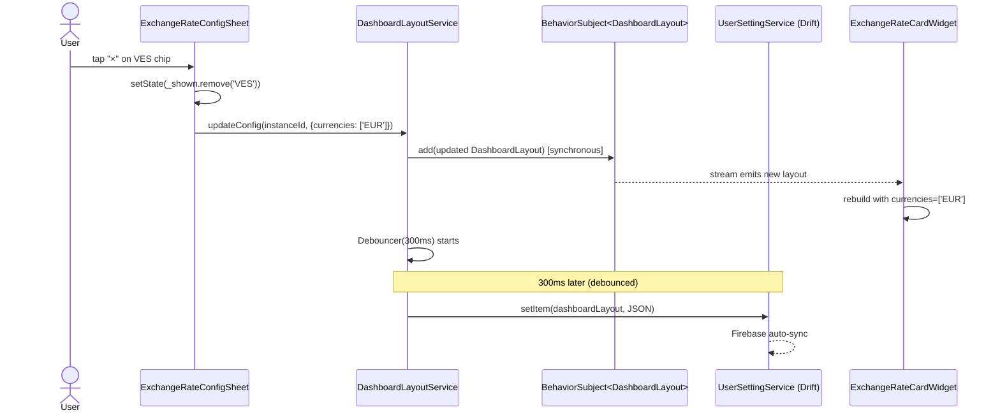

# Design: exchange-rate-widget-config

## 1. Component Diagram

```
registry_bootstrap.dart
  │  sets exchangeRateConfigEditorBuilder (↓ after register)
  │
  ├── registerExchangeRateCardWidget()         [widgets/exchange_rate_card_widget.dart]
  │     └── DashboardWidgetSpec(configEditor: (ctx, desc) => exchangeRateConfigEditorBuilder!(ctx, desc))
  │
  └── exchangeRateConfigEditorBuilder = (ctx, desc) => ExchangeRateConfigSheet(descriptor: desc)
                                                           [edit/exchange_rate_config_sheet.dart]

DashboardLayoutService.instance          ← source of truth (BehaviorSubject<DashboardLayout>)
  └── updateConfig(instanceId, newConfig) ← called by ExchangeRateConfigSheet on each add/remove

ExchangeRateCardWidget
  └── _RatesList
        ├── _effectiveCurrencies()        ← reads descriptor.config['currencies'] (fixed after bug fix)
        ├── StreamBuilder(getExchangeRates)
        │     └── _RateRow(×n)
        └── _PromedioRow (conditional)    ← shown only when both VES/BCV and VES/Paralelo rows present
```

### Key design decisions

**ADR-1 — No re-architecture of `_effectiveCurrencies`.**
The `_effectiveCurrencies()` policy-merge logic (adding pair currencies for non-VES DualMode) is kept but the `set.remove(pref)` line is removed. The removal was the root bug: it silently deleted the only non-EUR currency from the set when `preferredCurrency == 'USD'`, producing `{EUR}` and rendering a lone EUR row that looked like "EUR/EUR". The policy-merge additions (for non-VES dual users) continue to work as before.

**ADR-2 — `defaultConfig` seed change is the primary fix for new installs.**
Existing persisted configs (`['USD', 'EUR']`) stay untouched — no auto-migration. The config sheet gives users a one-tap path to adjust. For new installs / onboarding-seeded layouts, `defaults.dart` overrides the seed depending on `preferredCurrency`.

**ADR-3 — Config sheet uses two sections, not two tabs.**
QuickUse uses a `TabBar` because it has categorised hidden items. The exchange-rate picker is simpler: a flat list of "shown" chips (with remove buttons) and a "Agregar" section of remaining available currencies. A single scrollable column with two labelled sections is sufficient and reduces widget count.

**ADR-4 — Currency picker filtered by live rate rows, not full DB.**
`CurrencyService.getAllCurrencies()` returns all ~170+ seed currencies. Showing all of them in the picker is unusable. The picker will instead use the same `ExchangeRateService.instance.getExchangeRates()` stream to build the set of currencies that have actual rate rows, then subtract the already-shown ones.

**ADR-5 — `_PromedioRow` is purely UI computation, no DB write.**
The average is calculated directly in `_RatesList.build()` from the already-fetched snapshot data. No new stream, no extra service call. This keeps the widget pure and avoids any data-layer entanglement.

---

## 2. Data Flow: config change propagation

```
User taps "×" on a chip in ExchangeRateConfigSheet
  → _removeChip(code) → setState (local list update → immediate UI)
  → _persist() → DashboardLayoutService.instance.updateConfig(instanceId, newConfig)
      → layout BehaviorSubject.add(updated DashboardLayout)  [synchronous]
      → Debouncer(300ms) → UserSettingService.setItem(dashboardLayout, encoded)
                               → Firebase sync (existing auto-sync pathway)

Dashboard renderer (StreamBuilder on DashboardLayoutService.stream)
  → rebuilds descriptor list
  → ExchangeRateCardWidget receives new `currencies` param
  → _RatesList(_effectiveCurrencies()) filters rate rows
  → _RateRow and optional _PromedioRow rebuild
```

The rebuild chain is driven by the existing `BehaviorSubject` in `DashboardLayoutService`. No additional ChangeNotifier or ValueNotifier is needed.

---

## 3. `_effectiveCurrencies()` Before / After

### Before (buggy)

```dart
Set<String> _effectiveCurrencies() {
  final set = <String>{...currencies.map((c) => c.toUpperCase())};
  // ... policy merge additions ...
  final pref = appStateSettings[SettingKey.preferredCurrency];
  if (pref != null) {
    set.remove(pref);  // BUG: removes USD from {'USD','EUR'} → {'EUR'}
  }
  return set;
}
```

When `preferredCurrency == 'USD'` and `currencies == ['USD', 'EUR']`:
- set starts as `{USD, EUR}`
- `set.remove('USD')` → `{EUR}`
- widget only shows a EUR row with no reference currency → displays as "EUR/EUR" visually

### After (fixed)

```dart
Set<String> _effectiveCurrencies() {
  final set = <String>{...currencies.map((c) => c.toUpperCase())};
  final p = policy;
  if (p is SingleMode) {
    if (p.code != 'USD') set.add(p.code);
  } else if (p is DualMode) {
    if (!p.showsRateSourceChip) {
      set.add(p.primary);
      set.add(p.secondary);
    }
  }
  // REMOVED: set.remove(pref) — was the root cause of the EUR/EUR bug.
  // The preferred currency is the storage base, but it DOES have a valid
  // display rate (e.g. 1 USD = 39 VES). Removing it made the widget useless.
  return set;
}
```

The `defaultConfig` seed also changes from `['USD', 'EUR']` → `['VES', 'EUR']`.
With this seed and no removal, `_effectiveCurrencies()` returns `{VES, EUR}` — two useful rows for a Venezuelan user.

---

## 4. `_PromedioRow` Calculation and Display Logic

### Detection condition

After `getExchangeRates()` returns the full row list, `_RatesList.build()` scans for:
- A row where `currencyCode == 'VES'` AND `source == 'bcv'` → `bcvRow`
- A row where `currencyCode == 'VES'` AND `source == 'paralelo'` → `paraleloRow`

Both must be non-null AND `'VES'` must be in `wanted` (the effective currencies set) for the Promedio row to render.

### Widget structure

```dart
class _PromedioRow extends StatelessWidget {
  const _PromedioRow({required this.bcvRate, required this.paraleloRate});

  final double bcvRate;
  final double paraleloRate;

  double get _promedio => (bcvRate + paraleloRate) / 2;

  @override
  Widget build(BuildContext context) {
    // Matches _RateRow visual layout:
    // [currencyLabel] [badge] [age placeholder] [value]
    // Uses theme colors only — no hardcoded hex.
    // "Prom." badge replaces RateSourceBadge.
  }
}
```

The `_PromedioRow` is added after the `for (final row in rows)` loop, with a thin visual separator (a faint divider or extra vertical padding) to distinguish it from the live rate rows. It carries no `date` field — the label reads "Calculado" or "Prom." in the age position using the same muted `bodySmall` color.

### Why source == 'bcv' and source == 'paralelo' (not a fallback)

The rate rows from `getExchangeRates()` (via `getLastExchangeRates`) return the latest row per currency code. Since BCV and Paralelo are stored as **separate rows** (different `source` values, both with `currencyCode == 'VES'`), the stream emits both. The Promedio logic must filter by both `currencyCode` AND `source` to correctly identify each.

---

## 5. Import Cycle Solution

The import cycle is:
```
widgets/exchange_rate_card_widget.dart  (wants to call config sheet)
  ↕ would create cycle ↕
edit/exchange_rate_config_sheet.dart    (imports widget models from widgets/)
```

**Solution: global nullable function variable** (identical pattern to `quickUseConfigEditorBuilder`).

In `widgets/exchange_rate_card_widget.dart`, declare at file scope:

```dart
/// Wired in registry_bootstrap.dart after registerExchangeRateCardWidget().
/// null-safe: the spec's configEditor returns a placeholder if builder is null
/// (only affects tests that skip bootstrap).
Widget Function(BuildContext, WidgetDescriptor)? exchangeRateConfigEditorBuilder;
```

In `DashboardWidgetSpec.configEditor` inside `registerExchangeRateCardWidget()`:

```dart
configEditor: (context, descriptor) {
  final builder = exchangeRateConfigEditorBuilder;
  if (builder == null) {
    return const Center(child: Text('Config not wired'));
  }
  return builder(context, descriptor);
},
```

In `registry_bootstrap.dart`, after calling `registerExchangeRateCardWidget()`:

```dart
import 'package:nitido/app/home/dashboard_widgets/edit/exchange_rate_config_sheet.dart';

// (add to registerDashboardWidgets body)
exchangeRateConfigEditorBuilder = (context, descriptor) {
  return ExchangeRateConfigSheet(descriptor: descriptor);
};
```

This breaks the cycle: `exchange_rate_card_widget.dart` never imports the sheet; `registry_bootstrap.dart` is the only file that imports both.

---

## 6. Currency Catalog Filtering in the Config Sheet

The picker must show only currencies that have at least one live rate row — not the full 170+ seed catalogue.

**Approach: derive the addable set from the `getExchangeRates()` stream** (already open inside `_RatesList`). In the config sheet, open the same stream independently:

```dart
// In ExchangeRateConfigSheet state:
StreamBuilder<List<ExchangeRate>>(
  stream: ExchangeRateService.instance.getExchangeRates(),
  builder: (context, snap) {
    if (!snap.hasData) return const SizedBox.shrink();
    final available = snap.data!
        .map((r) => r.currencyCode.toUpperCase())
        .toSet()
      ..removeAll(_shown);      // exclude already-shown currencies
    return _buildAddSection(context, available);
  },
)
```

`_shown` is the local state list (the mutable copy of `descriptor.config['currencies']`).

**Why not `CurrencyService.getAllCurrencies()`?**
It returns every DB-seeded currency regardless of whether the user has a rate for it. A currency without a rate row would be addable but render nothing in the card — a confusing UX. Using `getExchangeRates()` guarantees every addable entry will produce a visible row.

---

## 7. State Management in the Config Sheet

Mirrors `QuickUseConfigSheet` exactly:

| Concern | Mechanism |
|---------|-----------|
| Local list of shown currencies | `List<String> _shown` — initialized in `initState` from `descriptor.config['currencies']` |
| Immediate UI feedback | `setState(() => _shown.add/remove(code))` |
| Persistence | `_persist()` → `DashboardLayoutService.instance.updateConfig(descriptor.instanceId, {...descriptor.config, 'currencies': _shown})` |
| When to persist | On every add or remove (same as QuickUse — debouncer in the service coalesces writes) |
| Sheet close | No-op: changes already persisted; user can swipe-down or tap "Listo" |
| Min currencies guard | Allow removing down to 1 currency (widget has an empty-state message already) |

### `initState` parsing (defensive)

```dart
static List<String> _readCurrenciesFromDescriptor(WidgetDescriptor d) {
  final raw = d.config['currencies'];
  if (raw is! List) return <String>['VES', 'EUR'];
  final out = raw.whereType<String>().map((s) => s.toUpperCase()).toList();
  return out.isEmpty ? <String>['VES', 'EUR'] : out;
}
```

---

## 8. Mermaid Sequence Diagram — Config Change Flow



---

## 9. Defaults Patch in `defaults.dart`

`_buildDescriptors()` currently applies a special config only for `quickUse`. After this change it also applies one for `exchangeRateCard`:

```dart
Map<String, dynamic> get _exchangeRateCardConfig {
  final pref = appStateSettings[SettingKey.preferredCurrency];
  // USD users: show VES (the volatile pair) + EUR
  // VES users: show USD (the reference pair) + EUR
  // Default / other: show VES + EUR (safe for Venezuelan context)
  final currencies = (pref == 'USD')
      ? <String>['VES', 'EUR']
      : <String>['USD', 'EUR'];
  return <String, dynamic>{'currencies': currencies};
}
```

And in `_buildDescriptors()`:

```dart
final config = switch (type) {
  WidgetType.quickUse => _quickUseFixedConfig,
  WidgetType.exchangeRateCard => _exchangeRateCardConfig,
  _ => spec.defaultConfig,
};
```

`appStateSettings[SettingKey.preferredCurrency]` is a synchronous map read (populated at app boot before `runApp`, same as all other uses in the codebase). No async read needed.

---

## 10. Risks and Constraints

| Risk | Impact | Mitigation |
|------|--------|------------|
| Existing users have stale config `['USD','EUR']` — after the `set.remove` fix, USD reappears. That is the correct behavior (bug was hiding it), but users who deliberately preferred seeing only EUR have no control until they open the config sheet. | Low — seeing more data is not harmful | Config sheet accessible from edit mode. No auto-migration needed. |
| `getExchangeRates()` opened twice (once in `_RatesList`, once in config sheet) — two stream subscriptions to the same Drift query. | Negligible | Drift watch queries are multiplexed at the DB level; two listeners do not double-query. |
| `appStateSettings` read in `_buildDescriptors()` runs at layout-build time (cold start or onboarding). If `preferredCurrency` has not been written yet, `pref` is null and the fallback `['USD','EUR']` fires. After the bug fix, this produces a USD and EUR row — reasonable for a first-run user with unknown pref. | Low | Acceptable default. Config sheet lets user adjust. |
| `_PromedioRow` uses raw `source` string comparison (`'bcv'`, `'paralelo'`). If `RateSource` enum values are ever renamed the comparison silently stops matching. | Low | Document the coupling. Future: compare against `RateSource.bcv.name` constant. |
| Config sheet opens inside a `showModalBottomSheet`. On low-end devices with the rate stream + currency stream both active, the sheet may show a brief loading spinner. | Low | Both streams are backed by Drift watch (in-process SQLite) — typically sub-frame latency. |
