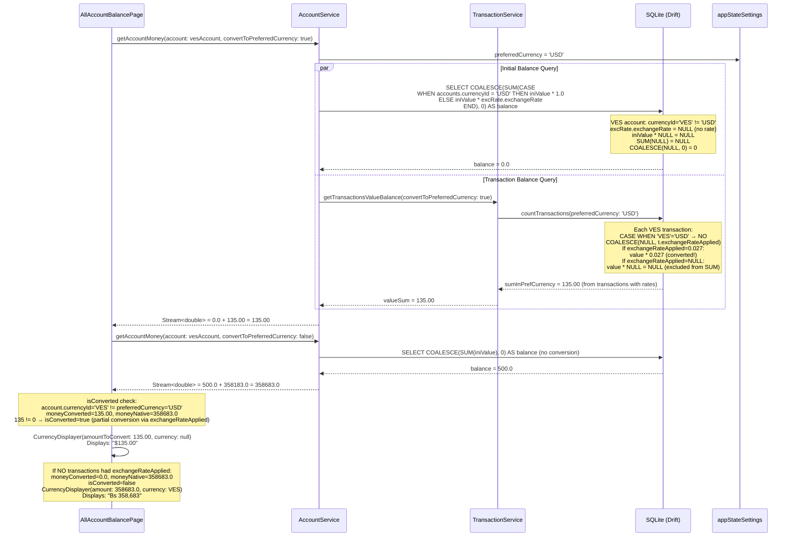
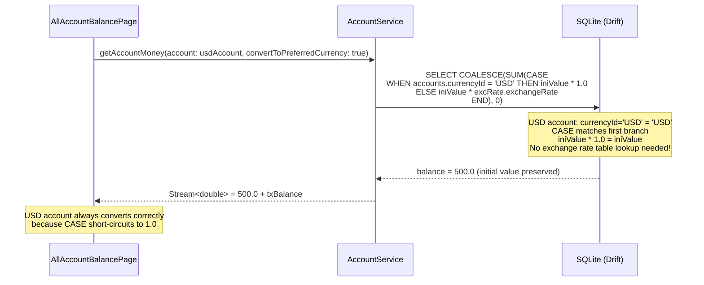
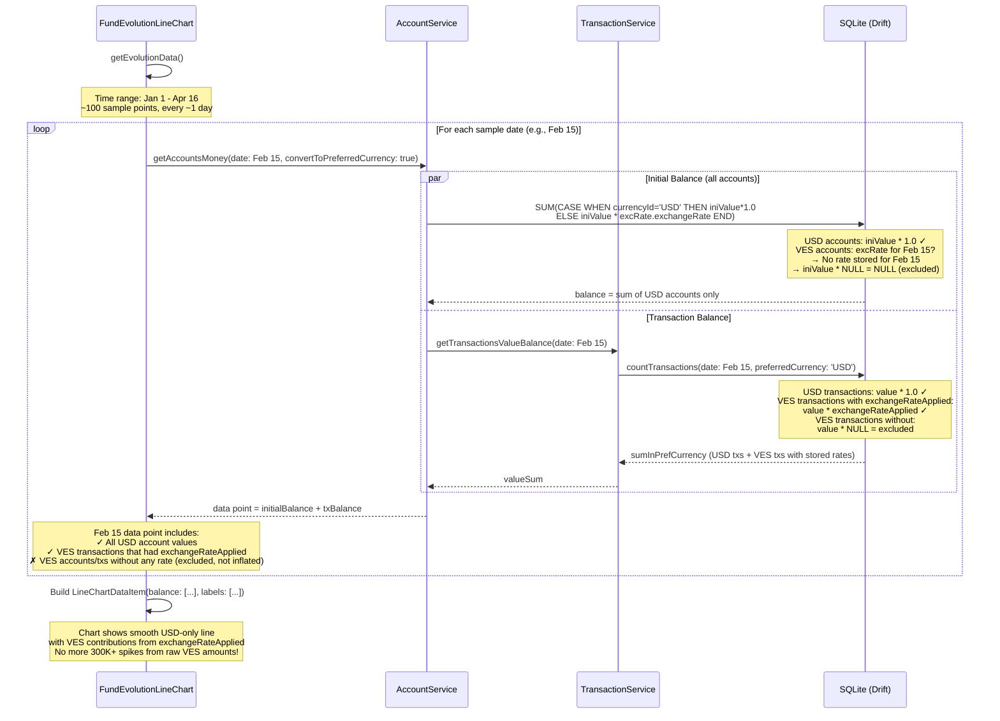

# SDD Design: fix-exchange-rate-fallback

**Date:** 2026-04-16
**Author:** Ramses Briceno
**Status:** Draft
**Change ID:** fix-exchange-rate-fallback

---

## 1. SQL Query Changes (Tier 1 + Tier 2)

### 1.1 Identity Case: CASE Expression vs Virtual JOIN Row

**Decision: CASE expression (Option A).**

**Why not Option B (virtual JOIN row)?**

The exchange rate LEFT JOIN subquery is defined in three places:
1. `select-full-data.drift` (inline, duplicated for `excRate` and `excRateOfDestiny`)
2. `account_service.dart` `_joinAccountAndRate()` helper (raw SQL string)
3. `transaction_filter_set.dart` (references `excRate` from the drift query's JOIN)

Injecting a virtual row (`UNION ALL SELECT :preferredCurrency, 1.0`) into the subquery would require:
- Threading the `preferredCurrency` parameter into every JOIN subquery
- Modifying `_joinAccountAndRate()` to accept a currency parameter
- Extra variable bindings in the drift-generated code

The CASE expression is **local to each SELECT column** and does not modify the JOIN structure. It is simpler, has fewer moving parts, and is easier to verify in isolation.

However, there is a critical constraint: **the existing SQL queries do not receive the preferred currency code as a parameter.** The exchange rates table stores rates relative to the preferred currency implicitly (the rate provider writes `1 VES = X USD` when preferred is USD). The `preferredCurrency` must be injected as a new parameter.

For the `.drift` file queries, this means adding a new named parameter `:preferredCurrency AS TEXT`. For the raw SQL in `account_service.dart`, it means adding a new `Variable.withString(preferredCurrency)` binding and reading it from `appStateSettings[SettingKey.preferredCurrency] ?? 'USD'`.

### 1.2 Exact SQL Replacements

#### Location 1: `select-full-data.drift` line 49

**Before:**
```sql
t.value * COALESCE(excRate.exchangeRate,1) as currentValueInPreferredCurrency,
```

**After (Tier 1 + Tier 2):**
```sql
t.value * CASE
  WHEN a.currencyId = :preferredCurrency THEN 1.0
  ELSE COALESCE(excRate.exchangeRate, t.exchangeRateApplied)
END as currentValueInPreferredCurrency,
```

**Behavior:**
- Account currency IS preferred currency: rate = 1.0, no table lookup needed
- Account has exchange rate in table: uses table rate (current market rate)
- Account has no table rate but transaction has `exchangeRateApplied`: uses the rate from transaction creation time
- None of the above: `CASE` returns `NULL`, multiplication yields `NULL` -- transaction is unconvertible

#### Location 2: `select-full-data.drift` line 50

**Before:**
```sql
t.valueInDestiny * COALESCE(excRateOfDestiny.exchangeRate,1) as currentValueInDestinyInPreferredCurrency,
```

**After (Tier 1 + Tier 2):**
```sql
t.valueInDestiny * CASE
  WHEN ra.currencyId = :preferredCurrency THEN 1.0
  ELSE COALESCE(excRateOfDestiny.exchangeRate, t.exchangeRateApplied)
END as currentValueInDestinyInPreferredCurrency,
```

**Note on `t.exchangeRateApplied` for destination:** The `exchangeRateApplied` field records the rate used when the transaction was created. For transfers, this rate is for the source account's currency conversion, not the destination's. However, it is still a better approximation than `1.0` or `NULL` for the destination side. If this becomes a concern, the fallback for the destination can be limited to `excRateOfDestiny.exchangeRate` alone (no `t.exchangeRateApplied`). For V1, we use it as a best-effort fallback.

#### Location 3: `select-full-data.drift` line 102

**Before:**
```sql
COALESCE(SUM(t.value * COALESCE(excRate.exchangeRate,1)), 0) AS sumInPrefCurrency,
```

**After (Tier 1 + Tier 2):**
```sql
COALESCE(SUM(t.value * CASE
  WHEN a.currencyId = :preferredCurrency THEN 1.0
  ELSE COALESCE(excRate.exchangeRate, t.exchangeRateApplied)
END), 0) AS sumInPrefCurrency,
```

**The outer `COALESCE(..., 0)` is preserved.** When ALL transactions are unconvertible, `SUM(NULL)` returns `NULL`, and `COALESCE(NULL, 0)` returns `0`. This is correct: a total where nothing can be converted should be zero, not NULL.

#### Location 4: `select-full-data.drift` line 103

**Before:**
```sql
COALESCE(SUM(COALESCE(t.valueInDestiny,t.value) * COALESCE(excRateOfDestiny.exchangeRate,1)), 0) AS sumInDestinyInPrefCurrency
```

**After (Tier 1 + Tier 2):**
```sql
COALESCE(SUM(COALESCE(t.valueInDestiny,t.value) * CASE
  WHEN COALESCE(ra.currencyId, a.currencyId) = :preferredCurrency THEN 1.0
  ELSE COALESCE(excRateOfDestiny.exchangeRate, t.exchangeRateApplied)
END), 0) AS sumInDestinyInPrefCurrency
```

**Why `COALESCE(ra.currencyId, a.currencyId)`:** The `ra` (receiving account) may be NULL for non-transfer transactions. When `ra` is NULL, `ra.currencyId` is NULL, and we fall back to `a.currencyId`. This mirrors the existing `COALESCE(t.valueInDestiny, t.value)` pattern.

#### Location 5: `account_service.dart` line 144 (raw SQL in `getAccountsMoney()`)

**Before:**
```dart
'ELSE accounts.iniValue ${convertToPreferredCurrency ? ' * COALESCE(excRate.exchangeRate, 1)' : ''}'
```

**After (Tier 1 only -- no Tier 2 fallback available):**
```dart
'ELSE accounts.iniValue ${convertToPreferredCurrency ? ' * CASE WHEN accounts.currencyId = ? THEN 1.0 ELSE excRate.exchangeRate END' : ''}'
```

**No `exchangeRateApplied` fallback.** The initial balance (`iniValue`) is an account-level field with no associated transaction. There is no per-row exchange rate to fall back on. When the exchange rate table has no entry for this currency, the result is `iniValue * NULL = NULL`, which propagates through `SUM` as expected.

**New variable binding required:**
```dart
variables: [
  Variable.withDateTime(useDate),
  if (convertToPreferredCurrency)
    Variable.withString(
      appStateSettings[SettingKey.preferredCurrency] ?? 'USD',
    ),
  if (convertToPreferredCurrency && date != null)
    Variable.withDateTime(useDate),
  if (accountIds != null)
    for (final id in accountIds) Variable.withString(id),
],
```

The `preferredCurrency` variable is bound BEFORE the date variable from `_joinAccountAndRate()`, so it must be inserted at the correct position in the variable list. The full SQL becomes:

```sql
SELECT COALESCE(
  SUM(
    CASE WHEN accounts.date > ? THEN 0
    ELSE accounts.iniValue * CASE WHEN accounts.currencyId = ? THEN 1.0 ELSE excRate.exchangeRate END
    END
  )
, 0) AS balance
FROM accounts
  LEFT JOIN (...) AS excRate ON accounts.currencyId = excRate.currencyCode
  WHERE accounts.id IN (?, ?, ...)
```

**Import required:** `account_service.dart` must import `user_setting_service.dart` to access `appStateSettings` and `SettingKey`.

#### Locations 6-7: `transaction_filter_set.dart` lines 161, 166

**Before:**
```dart
'(ABS(t.value * COALESCE(excRate.exchangeRate,1)) <= $maxValue)',
'(ABS(t.value * COALESCE(excRate.exchangeRate,1)) >= $minValue)',
```

**After (Tier 1 + Tier 2):**
```dart
'(ABS(t.value * CASE WHEN a.currencyId = \'$preferredCurrency\' THEN 1.0 ELSE COALESCE(excRate.exchangeRate, t.exchangeRateApplied) END) <= $maxValue)',
'(ABS(t.value * CASE WHEN a.currencyId = \'$preferredCurrency\' THEN 1.0 ELSE COALESCE(excRate.exchangeRate, t.exchangeRateApplied) END) >= $minValue)',
```

**Where `preferredCurrency` comes from:** Read from `appStateSettings[SettingKey.preferredCurrency] ?? 'USD'` at the top of the `toTransactionExpression()` method. Since this is a `CustomExpression` (string interpolation, not parameterized), the value is inlined directly. This is safe because the currency code is a controlled value from the app's settings, not user-supplied text.

**Behavior when rate is missing:** `CASE ... END` returns `NULL`, so `ABS(value * NULL)` is `NULL`, and `NULL <= $maxValue` is `NULL` (falsy in SQLite). This means **transactions without convertible rates are excluded from filter matches**. This is the correct behavior: a transaction that cannot be converted to the preferred currency cannot be meaningfully compared to a preferred-currency threshold.

### 1.3 Parameter Threading for `:preferredCurrency`

The `countTransactions` drift query needs the new `:preferredCurrency` parameter. Current signature:

```
countTransactions($predicate = TRUE, :date AS DATETIME):
```

**New signature:**
```
countTransactions($predicate = TRUE, :date AS DATETIME, :preferredCurrency AS TEXT):
```

All callers of `countTransactions` in `transaction_service.dart` must pass this new parameter. The value comes from:
```dart
final preferredCurrency = appStateSettings[SettingKey.preferredCurrency] ?? 'USD';
```

Similarly, `getTransactionsWithFullData` needs the parameter:

```
getTransactionsWithFullData($predicate = TRUE, :preferredCurrency AS TEXT) WITH MoneyTransaction:
```

All callers in `transaction_service.dart` (e.g., `getTransactionById`, `getTransactions`) must pass it.

---

## 2. Drift Code Regeneration

### 2.1 Commands

After modifying `select-full-data.drift`, run:

```bash
cd c:\Users\ramse\OneDrive\Documents\vacas\monekin_finance
dart run build_runner build --delete-conflicting-outputs
```

Or for continuous watching during development:

```bash
dart run build_runner watch --delete-conflicting-outputs
```

### 2.2 Files That Will Be Regenerated

The drift code generator produces `.g.dart` files from `.drift` files. The affected generated files:

| Source File | Generated File |
|-------------|----------------|
| `lib/core/database/sql/queries/select-full-data.drift` | `lib/core/database/sql/queries/select-full-data.drift.dart` |
| `lib/core/database/app_db.dart` | `lib/core/database/app_db.g.dart` |

### 2.3 Expected Type Changes in Generated Code

The `getTransactionsWithFullData` query currently generates `MoneyTransaction` with `currentValueInPreferredCurrency` as `double` (non-nullable). After the SQL change, the CASE expression can return NULL, so the generated type will become `double?` (nullable).

This will cause **compile errors** in every consumer of `MoneyTransaction.currentValueInPreferredCurrency`. These must be resolved in Tier 3 (see Section 4).

The `countTransactions` query's `sumInPrefCurrency` and `sumInDestinyInPrefCurrency` remain wrapped in `COALESCE(..., 0)`, so they stay as `double` (non-nullable). No type change there.

### 2.4 New Parameter in Generated Code

The generated `countTransactions` method will gain a `preferredCurrency` parameter:
```dart
// Before:
Selectable<CountTransactionsResult> countTransactions({
  required Expression<bool> predicate,
  required DateTime date,
});

// After:
Selectable<CountTransactionsResult> countTransactions({
  required Expression<bool> predicate,
  required DateTime date,
  required String preferredCurrency,
});
```

Similarly for `getTransactionsWithFullData`.

---

## 3. Dart Service Changes

### 3.1 `MoneyTransaction` Model (`transaction.dart`)

**Current:**
```dart
double currentValueInPreferredCurrency;
```

**After:**
```dart
double? currentValueInPreferredCurrency;
```

This is a **breaking change** that propagates to:
- `getCurrentBalanceInPreferredCurrency()` -- must handle null
- `getUnifiedMoneyForAPeriod()` -- must handle null
- Every widget that displays `currentValueInPreferredCurrency`

**`getCurrentBalanceInPreferredCurrency()` change:**
```dart
// Before:
double getCurrentBalanceInPreferredCurrency() {
  if (type == TransactionType.transfer) {
    return (currentValueInDestinyInPreferredCurrency ??
            currentValueInPreferredCurrency) -
        currentValueInPreferredCurrency;
  }
  return currentValueInPreferredCurrency;
}

// After:
double? getCurrentBalanceInPreferredCurrency() {
  if (currentValueInPreferredCurrency == null) return null;
  if (type == TransactionType.transfer) {
    final destiny = currentValueInDestinyInPreferredCurrency ??
        currentValueInPreferredCurrency!;
    return destiny - currentValueInPreferredCurrency!;
  }
  return currentValueInPreferredCurrency;
}
```

### 3.2 `getAccountsMoney()` in `account_service.dart`

**Tier 1-3 approach: keep `Stream<double>` return type.**

The `getAccountsMoney()` method currently returns `Stream<double>`. For Tiers 1-3, we keep this return type. The behavior changes subtly:

- Accounts in the preferred currency: rate = 1.0 via CASE, included in sum (same as before)
- Accounts with table rate: converted normally (same as before)
- Accounts with no rate (and no `exchangeRateApplied` for initial balance): `iniValue * NULL = NULL`, excluded from SUM, `COALESCE(SUM(NULL), 0) = 0`

This means the returned `double` is now the sum of **only convertible amounts**. Unconvertible amounts silently vanish from the total. This is acceptable for Tiers 1-3 because:
1. It eliminates the catastrophic inflation (the primary bug)
2. The per-account display (Tier 3) will show native currency for unconvertible accounts

**Tier 4 (deferred): change return type to `MoneyBalance`.**

```dart
class MoneyBalance {
  /// Sum of all account balances that were successfully converted to the preferred currency.
  final double convertedTotal;

  /// Accounts whose balances could NOT be converted. Keyed by currency code.
  /// Each entry is: currency code -> (native balance sum, CurrencyInDB).
  final Map<String, UnconvertedEntry> unconverted;

  bool get isFullyConverted => unconverted.isEmpty;

  /// Total display-ready amount: convertedTotal if fully converted,
  /// otherwise a compound representation.
  double get displayTotal => convertedTotal;

  const MoneyBalance({
    required this.convertedTotal,
    this.unconverted = const {},
  });
}

class UnconvertedEntry {
  final double amount;
  final CurrencyInDB currency;

  const UnconvertedEntry({required this.amount, required this.currency});
}
```

This requires a fundamentally different query approach: instead of a single SUM, we need per-account results grouped by convertibility. This is why Tier 4 is deferred.

### 3.3 `TransactionService._countTransactions()` Changes

All calls to `db.countTransactions()` must pass the new `preferredCurrency` parameter:

```dart
// Before:
db.countTransactions(
  predicate: predicate.toTransactionExpression(),
  date: exchangeDate,
).watchSingle(),

// After:
db.countTransactions(
  predicate: predicate.toTransactionExpression(),
  date: exchangeDate,
  preferredCurrency: appStateSettings[SettingKey.preferredCurrency] ?? 'USD',
).watchSingle(),
```

This applies to all three invocations in `_countTransactions()` (income/expenses, transfers from origin, transfers from destiny) and the single invocation at the bottom of the method.

### 3.4 `TransactionService` Transaction Fetching Changes

All calls to `db.getTransactionsWithFullData()` must also pass `preferredCurrency`:

```dart
db.getTransactionsWithFullData(
  predicate: ...,
  preferredCurrency: appStateSettings[SettingKey.preferredCurrency] ?? 'USD',
).watch();
```

### 3.5 Import Changes

Files that need to import `user_setting_service.dart`:

| File | Currently imports? |
|------|-------------------|
| `account_service.dart` | No -- needs import |
| `transaction_service.dart` | No -- needs import |
| `transaction_filter_set.dart` | No -- needs import |

Add to each:
```dart
import 'package:wallex/core/database/services/user-setting/user_setting_service.dart';
```

---

## 4. Display Layer Changes

### 4.1 `all_accounts_balance.dart` -- Per-Account Balance Display (Tier 3)

**Problem:** When `convertToPreferredCurrency: true` is used and the rate is missing, the account balance becomes 0 (NULL excluded from SUM). The `CurrencyDisplayer` shows `$0.00` with the preferred currency symbol.

**Solution: Dual-query approach.** For each account, request both the converted and native balances:

```dart
Future<List<AccountWithMoney>> getAccountsWithMoney(
  DateTime date, {
  TransactionFilterSet filters = const TransactionFilterSet(),
}) async {
  final accounts = (await filters.accounts().first).where(
    (element) =>
        !element.isClosed || element.closingDate!.compareTo(date) >= 0,
  );

  final balances = accounts.map(
    (account) async {
      final convertedMoney = await AccountService.instance
          .getAccountMoney(
            account: account,
            trFilters: filters,
            convertToPreferredCurrency: true,
            date: date,
          )
          .first;

      final nativeMoney = await AccountService.instance
          .getAccountMoney(
            account: account,
            trFilters: filters,
            convertToPreferredCurrency: false,
            date: date,
          )
          .first;

      return AccountWithMoney(
        moneyConverted: convertedMoney,
        moneyNative: nativeMoney,
        account: account,
      );
    },
  );

  final toReturn = await Future.wait(balances);
  // Sort by converted amount when available, native amount otherwise
  toReturn.sort((a, b) => b.effectiveMoney.compareTo(a.effectiveMoney));

  return toReturn;
}
```

**Updated `AccountWithMoney` model:**

```dart
class AccountWithMoney {
  /// Balance converted to preferred currency. Will be 0 when rate is unavailable
  /// (because the SQL SUM excludes NULL amounts).
  final double moneyConverted;

  /// Balance in the account's native currency. Always available.
  final double moneyNative;

  final Account account;

  AccountWithMoney({
    required this.moneyConverted,
    required this.moneyNative,
    required this.account,
  });

  /// Whether conversion to preferred currency was meaningful.
  /// When the account IS in the preferred currency, converted == native and this is true.
  /// When no rate exists, converted == 0 and native != 0, so this is false.
  bool get isConverted {
    final preferredCurrency = appStateSettings[SettingKey.preferredCurrency] ?? 'USD';
    if (account.currencyId == preferredCurrency) return true;
    // If converted is 0 but native is not, conversion failed
    if (moneyConverted == 0 && moneyNative != 0) return false;
    return true;
  }

  /// The amount to use for display and sorting.
  double get effectiveMoney => isConverted ? moneyConverted : moneyNative;
}
```

**Updated `CurrencyDisplayer` usage at line ~165:**

```dart
CurrencyDisplayer(
  amountToConvert: accountWithMoney.isConverted
      ? accountWithMoney.moneyConverted
      : accountWithMoney.moneyNative,
  currency: accountWithMoney.isConverted
      ? null  // defaults to preferred currency
      : accountWithMoney.account.currency,
),
```

**Result:** A VES account with no rate shows "Bs 358,683" instead of "$358,683".

**"Balance by currency" section (`getCurrenciesWithMoney`):** This section currently groups by `account.currency.code` but shows amounts in preferred currency. After the fix:
- Converted accounts contribute their `moneyConverted` to the preferred currency group
- Unconverted accounts contribute their `moneyNative` to their native currency group

This naturally separates the display: `USD: $747` and `VES: Bs 380,768`.

### 4.2 `fund_evolution_info.dart` -- Chart Data (Tier 3)

**Problem:** The chart calls `getAccountsMoney()` with `convertToPreferredCurrency: true` for ~100 date sample points. Historical dates lack exchange rates, causing every data point to either inflate (current bug) or drop to near-zero (after Tier 1 fix).

**Tier 3 approach: exclude unconvertible accounts from the chart, show a warning badge.**

The chart already has an `accounts` parameter (nullable list of accounts to include). The fix:

1. Before building chart data, determine which accounts have exchange rates available for the date range.
2. Filter the account list to only convertible accounts.
3. Show a warning icon/badge when some accounts are excluded.

```dart
Stream<LineChartDataItem?> getEvolutionData() {
  final timeRange = widget.timeRange;
  if (timeRange == null) return Stream.value(null);

  // Determine preferred currency
  final preferredCurrency = appStateSettings[SettingKey.preferredCurrency] ?? 'USD';

  // Filter accounts: include only those in preferred currency OR with exchange rates
  final chartAccounts = accounts?.where((a) =>
    a.currencyId == preferredCurrency
  ).toList();
  // Note: This is a conservative approach. Accounts with rates would also work,
  // but checking rate availability per-date per-account is expensive.

  // ... rest of chart generation using chartAccounts ...
}
```

**Simpler alternative (recommended for V1):** Keep all accounts in the chart but add a footnote when the total seems inconsistent. The chart will show lower values for historical dates (where unconvertible accounts contribute 0) which is less distorted than the current inflated values. A future Tier 4 enhancement can add a proper split-chart view.

**Chart header balance (lines 80-98):** Same fix as the chart data -- the header already uses `getAccountsMoney()` which will now return the convertible-only total.

### 4.3 `CurrencyDisplayer` -- No Changes Needed

The `CurrencyDisplayer` widget (`currency_displayer.dart`) already supports:
- `amountToConvert: double` -- the amount to display
- `currency: CurrencyInDB?` -- explicit currency, or null to use preferred

No modifications are needed to this widget. The callers control what is passed.

---

## 5. Architecture Decision Records (ADRs)

### ADR-1: NULL Propagation Over Zero-Fallback

**Context:** When no exchange rate is available for a currency, the converted amount can be treated as either 0 (zero-fallback) or NULL (propagation).

**Decision:** Use NULL propagation in SQL. `value * NULL = NULL`, excluded from SUM aggregations.

**Rationale:**
- **Zero-fallback** (`COALESCE(rate, 0)`) would make `value * 0 = 0`, causing account balances to appear as zero. This is misleading -- the user has money in that account, it just cannot be converted.
- **NULL propagation** correctly represents "this value exists but cannot be expressed in the preferred currency." It allows the display layer to decide how to present unconvertible amounts (show in native currency, show a warning, etc.).
- The outer `COALESCE(SUM(...), 0)` in aggregation queries correctly handles the "all NULL" case by returning 0 for the total.
- This aligns with the Dart-side `ExchangeRateService.calculateExchangeRateToPreferredCurrency()` which already returns `null` for missing rates.

**Consequences:**
- `MoneyTransaction.currentValueInPreferredCurrency` becomes `double?` (nullable), requiring updates to all consumers.
- Aggregated totals silently exclude unconvertible amounts rather than inflating them. This is imperfect but safe.

### ADR-2: CASE Expression Over Virtual JOIN Row

**Context:** Accounts in the preferred currency have no entry in the `exchangeRates` table (rate is implicitly 1.0). After removing `COALESCE(..., 1)`, these accounts would also produce NULL.

**Decision:** Use `CASE WHEN a.currencyId = :preferredCurrency THEN 1.0 ELSE excRate.exchangeRate END`.

**Rationale:**
- The CASE expression is **local to each SELECT column** and does not modify the JOIN structure.
- A virtual JOIN row (`UNION ALL SELECT :preferredCurrency, 1.0`) would require modifying every LEFT JOIN subquery (3 places in drift, 1 in `_joinAccountAndRate()`), adding parameter threading, and ensuring no duplicate rows.
- The CASE expression is self-documenting: reading the query makes it obvious that same-currency accounts use rate 1.0.
- Performance is equivalent -- SQLite evaluates CASE before the NULL multiplication, short-circuiting the rate lookup.

**Consequences:**
- A new `:preferredCurrency` parameter must be threaded through `countTransactions`, `getTransactionsWithFullData`, and the raw SQL in `getAccountsMoney()`.
- All callers must read `appStateSettings[SettingKey.preferredCurrency]` and pass it to the queries.

### ADR-3: Compound Display Over Separate Charts (Tier 4, Deferred)

**Context:** When some accounts cannot be converted, the total balance could be shown as:
1. Only the converted portion (e.g., "$747")
2. A compound amount ("$747 + Bs 380,768")
3. Separate chart lines per currency

**Decision (for Tier 4):** Compound display ("$747 + Bs 380,768") for balance headers. For the chart, exclude unconvertible accounts with a warning badge.

**Rationale:**
- Showing only the converted portion (option 1) is what Tier 1-3 already does. It is the safe default.
- The compound display (option 2) is the most informative single-line representation. It tells the user exactly what their portfolio looks like across currencies.
- Separate chart lines (option 3) require major UI rework (multi-axis charts, color coding) and are out of scope.

**Consequences (Tier 4):**
- New `MoneyBalance` return type for `getAccountsMoney()`.
- New `MoneyBalanceDisplayer` widget for compound formatting.
- Every consumer of `getAccountsMoney()` must adapt to the new type.
- Chart remains single-line with convertible accounts only; a footnote indicates exclusions.

### ADR-4: Tier 4 Is Deferrable

**Context:** Tier 4 (compound aggregation, `MoneyBalance` return type) has the highest implementation complexity and widest blast radius.

**Decision:** Implement Tiers 1-3 first. Tier 4 is a follow-up change.

**Rationale:**
- **Tiers 1-2 fix the catastrophic bug:** VES amounts will no longer appear as USD. This alone resolves the three reported symptoms (inflated per-account balance, inflated total, distorted chart).
- **Tier 3 improves the display:** Unconvertible accounts show in native currency instead of disappearing.
- **Tier 4 is a UX enhancement, not a bug fix.** The user sees "$747" instead of "$747 + Bs 380,768" -- suboptimal but not incorrect, since the total IS $747 in convertible terms.
- Tier 4 changes the return type of `getAccountsMoney()`, which ripples into `getAccountMoney()`, `AllAccountBalancePage`, `FundEvolutionLineChart`, `DashboardPage`, and potentially more. The blast radius is 10+ files.
- Shipping Tiers 1-3 first provides immediate relief and a stable base for Tier 4 iteration.

**Consequences:**
- After Tiers 1-3, unconvertible accounts silently vanish from totals and charts. This is visible to the user as a lower total than expected, but not dangerously wrong.
- Tier 4 can be developed independently and merged without conflicting with the Tier 1-3 changes.

---

## 6. Sequence Diagrams

### 6.1 Loading "Saldo por cuentas" with Mixed Currencies



### 6.2 Loading "Saldo por cuentas" -- USD Account (Identity Case)



### 6.3 Building a Fund Evolution Chart Data Point



---

## 7. Implementation Checklist Summary

### Phase 1: Tier 1 + Tier 2 (SQL Layer)

1. Add `:preferredCurrency AS TEXT` parameter to `getTransactionsWithFullData` and `countTransactions` in `select-full-data.drift`
2. Replace all 4 COALESCE locations in `select-full-data.drift` with CASE expressions
3. Update raw SQL in `account_service.dart` `getAccountsMoney()` (location 5)
4. Update filter expressions in `transaction_filter_set.dart` (locations 6-7)
5. Add `preferredCurrency` parameter passing in `transaction_service.dart`
6. Add imports for `user_setting_service.dart` where needed
7. Run `dart run build_runner build --delete-conflicting-outputs`
8. Fix compile errors from nullable `currentValueInPreferredCurrency` in `MoneyTransaction`

### Phase 2: Tier 3 (Display Layer)

9. Update `AccountWithMoney` model to carry both converted and native amounts
10. Update `getAccountsWithMoney()` to fetch dual balances
11. Update `CurrencyDisplayer` calls to pass native currency when unconverted
12. Update `getCurrenciesWithMoney()` to group correctly
13. Handle chart header in `fund_evolution_info.dart`

### Phase 3: Tier 4 (Deferred)

14. Create `MoneyBalance` class
15. Change `getAccountsMoney()` return type
16. Create `MoneyBalanceDisplayer` widget
17. Update all consumers

---

## 8. Risk Mitigations

| Risk | Mitigation |
|------|------------|
| Variable binding order in raw SQL | Write a unit test that calls `getAccountsMoney()` with a known VES account and asserts the result is 0 (not inflated) |
| `:preferredCurrency` parameter not passed | Drift's generated code enforces required parameters at compile time; raw SQL will fail at runtime if variables are misaligned -- test immediately |
| `exchangeRateApplied` is NULL for older transactions | The COALESCE chain falls through to NULL, which is the desired behavior (exclude rather than inflate) |
| `isConverted` heuristic is imperfect | Edge case: an account with genuinely zero balance would show as "unconverted." Mitigated by checking `account.currencyId == preferredCurrency` first. |
| Performance: dual query in `getAccountsWithMoney()` | Each `getAccountMoney()` call is already a stream (reactive). The native-currency query skips the exchange rate JOIN entirely, so it is cheaper. Net overhead is ~50% more queries but simpler queries. |
