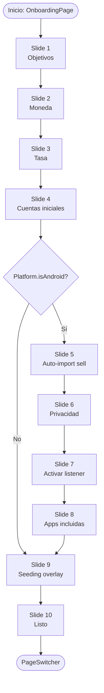
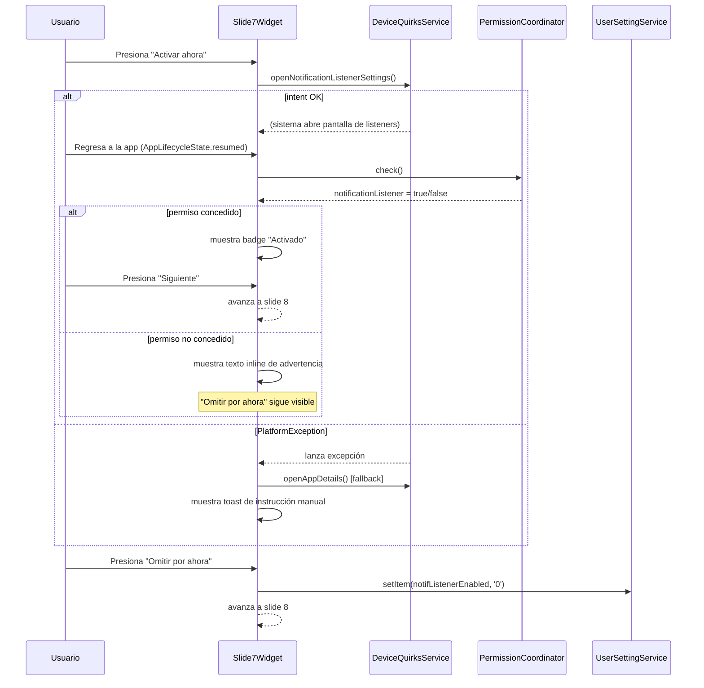
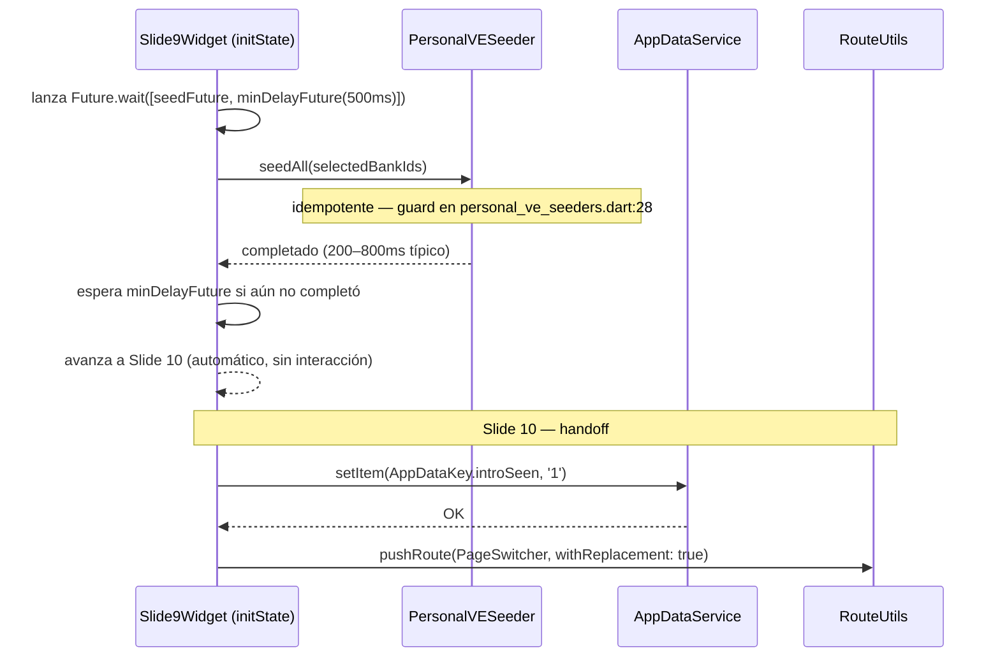
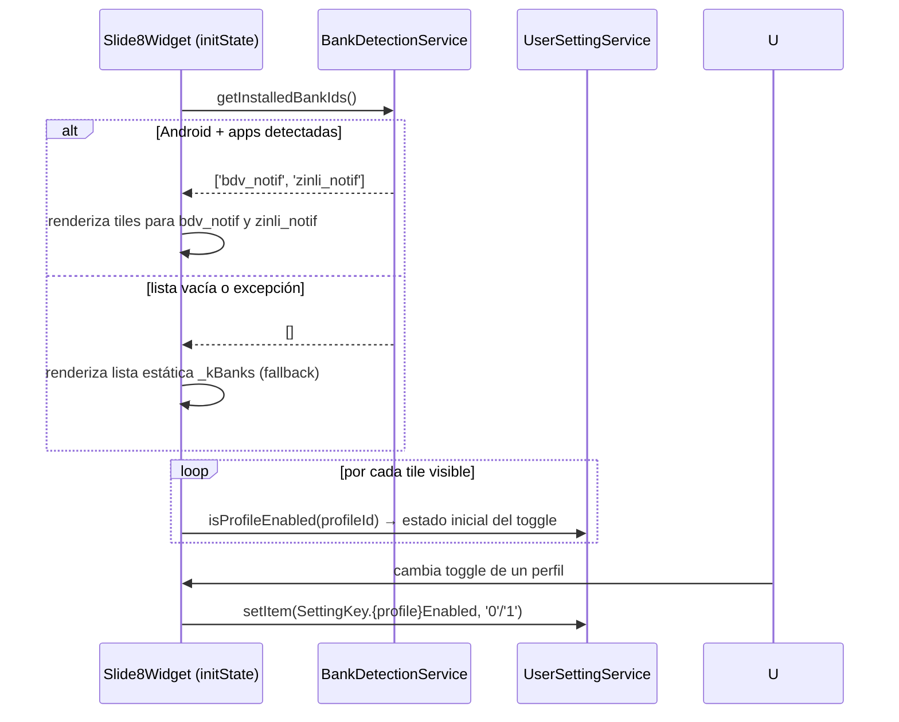

# Design: Onboarding v2 — Auto-Import First

## Enfoque técnico

Reemplazar el monolito de 1280 LOC en `onboarding.dart` con una jerarquía de
ficheros pequeños siguiendo la estructura feature-first existente. El estado
compartido (selecciones del usuario a lo largo de los 10 slides) se mantiene en
un único `_OnboardingPageState` que actúa como controller: crea los widgets de
cada slide, les pasa callbacks y es el único punto que llama a los servicios al
finalizar. Los slides individuales son `StatelessWidget` — reciben sus datos y
callbacks por constructor.

Este patrón es idéntico al `_OnboardingPageState` actual (ver `onboarding.dart:117`),
escalado de 4 a 10 slides y desacoplado en ficheros separados. No se introduce
ningún mecanismo de gestión de estado externo (`ChangeNotifier`, `Provider`,
`Riverpod`, `BehaviorSubject`) porque ninguno de los otros features de `lib/app/`
los emplea en widgets de pantalla completa, y el estado del onboarding no necesita
ser compartido fuera de esta jerarquía.

---

## Decisiones de arquitectura

### 1. Estado centralizado en `_OnboardingPageState`, slides stateless

| Opción | Tradeoff | Decisión |
|--------|----------|----------|
| `ChangeNotifier` + `ListenableBuilder` | Testeable de forma unitaria, más verboso, introduce una dependencia de patrón nueva en el layer `app/` | Rechazada |
| `StatefulWidget` raíz + `StatelessWidget` por slide (callbacks) | Coherente con el patrón existente del proyecto, cero dependencia nueva, toda la lógica de persistencia en un solo lugar | **Elegida** |
| `PageController` + estado distribuido por slide (`StatefulWidget` por slide) | Cada slide gestiona su propio estado; el controller necesita extraerlo al avanzar → acoplamiento bidireccional complicado | Rechazada |

**Rationale**: El onboarding se ejecuta una sola vez; el estado no viaja fuera de
`OnboardingPage`. Un `StatefulWidget` raíz con callbacks es suficiente y mantiene
la coherencia del proyecto.

---

### 2. Separación en ficheros: controller + slides + widgets + theme

```
lib/app/onboarding/
├── onboarding.dart               ← root widget + _OnboardingPageState (controller)
├── slides/
│   ├── s01_goals.dart
│   ├── s02_currency.dart
│   ├── s03_rate_source.dart
│   ├── s04_initial_accounts.dart
│   ├── s05_autoimport_sell.dart
│   ├── s06_privacy.dart
│   ├── s07_activate_listener.dart
│   ├── s08_apps_included.dart
│   ├── s09_seeding_overlay.dart
│   └── s10_ready.dart
├── widgets/
│   ├── v3_progress_bar.dart      ← barra segmentada 3px top-52
│   ├── v3_slide_template.dart    ← scaffold de slide (padding, scroll, botones)
│   ├── v3_goal_chip.dart
│   ├── v3_currency_tile.dart
│   ├── v3_rate_tile.dart
│   ├── v3_bank_tile.dart         ← placeholder geométrico + toggle
│   ├── v3_mini_phone.dart        ← animación notificación (slide 5)
│   ├── v3_notification_card.dart ← card animada con v3-notif-in
│   └── v3_seeding_overlay.dart
└── theme/
    └── v3_tokens.dart            ← colores, spacing, radii, duraciones
```

| Opción | Tradeoff | Decisión |
|--------|----------|----------|
| Todo en un solo `onboarding.dart` (patrón actual) | Simple, pero 1280 LOC inmanejable al escalar a 10 slides | Rechazada |
| Un fichero por slide + controller separado | Ficheros pequeños, testeable por slide, coherente con feature-first | **Elegida** |
| Carpeta `components/` plana sin subdivisión | Sin estructura semántica clara | Rechazada |

---

### 3. Tokens de diseño en `v3_tokens.dart`, no en `theme_data`

Los tokens v3 (accent `#C8B560`, spacing, radii, duraciones de animación) se
definen como constantes en `v3_tokens.dart` y se consumen directamente desde los
widgets de onboarding. No se modifica `ThemeData` ni `AppColors` globales porque
el sistema de tokens del onboarding es temporal — válido únicamente durante el
flujo de primera instalación. Modificar el tema global para un flujo de un único
uso contaminaría los tokens de la app.

---

### 4. Seeding overlay — mínimo 500ms con `Future.wait`

El slide 9 ejecuta `PersonalVESeeder.seedAll` y un `Future.delayed(500ms)` en
paralelo con `Future.wait([seedFuture, minDelayFuture])`. El avance automático
ocurre cuando ambos completan. Esto garantiza que la animación nunca se interrumpe
abruptamente si el seeding termina antes del umbral visual.

| Opción | Tradeoff | Decisión |
|--------|----------|----------|
| Avanzar en cuanto `seedAll` completa | Transición abrupta si el seeding es rápido (<200ms) | Rechazada |
| `Future.wait([seedAll, Future.delayed(500ms)])` | Mínimo visual garantizado, sin bloquear si seeding tarda más | **Elegida** |
| Delay fijo de 1500ms independiente del seeding | Bloquea innecesariamente en cold install | Rechazada |

---

### 5. Slide 7 — soft-skip sin modal bloqueante

El estado del permiso de listener se gestiona por `PermissionCoordinator` ya
existente. El slide 7 observa `PermissionCoordinator.state.notificationListener`
vía `WidgetsBindingObserver.didChangeAppLifecycleState` (mismo patrón que el
`_PermissionsPage` actual en `onboarding.dart:472`). Si el usuario omite, se
persiste `notifListenerEnabled = '0'`; no se muestra modal. La decisión está
documentada en el spec (Módulo 6, Riesgo de abandono).

---

### 6. `BankDetectionService` — wrapper, no singleton de servicio core

`BankDetectionService` es una clase simple (no singleton, no stream) en
`lib/core/services/bank_detection/`. El slide 8 la instancia directamente y
llama `getInstalledBankIds()` en `initState`. No se registra en ningún contenedor
de DI porque solo se usa en un lugar y su ciclo de vida es la duración del slide.

---

## Estructura de estado del controller

```dart
// _OnboardingPageState — campos de estado
Set<String> _selectedGoals = {};         // slide 1 → onboardingGoals JSON
String _selectedCurrency;                // slide 2 → preferredCurrency
String _selectedRateSource = 'bcv';      // slide 3 → preferredRateSource
Set<String> _selectedBankIds = {};       // slide 4 → seedAll(bankIds)
// Slides 5–8 persisten directamente vía UserSettingService (sin campo local)
// porque sus toggles son settings operativos (notifListenerEnabled,
// bdvNotifProfileEnabled, etc.) que deben ser legibles por otros servicios
// inmediatamente, incluso si el usuario abandona el onboarding tras el slide 8.
```

---

## Flujo de navegación completo



---

## Flujo del slide 7 — activar listener



---

## Flujo del seeding overlay (slide 9)



---

## Flujo de detección de bancos (slide 8)



---

## Tabla de ficheros nuevos / modificados

| Fichero | Operación | Notas |
|---------|-----------|-------|
| `lib/app/onboarding/onboarding.dart` | Reescritura | Controller + `PageView`; elimina lógica inline |
| `lib/app/onboarding/slides/s01_goals.dart` … `s10_ready.dart` | Nuevos (10) | Un `StatelessWidget` por slide |
| `lib/app/onboarding/widgets/v3_*.dart` | Nuevos (9) | Átomos reutilizables |
| `lib/app/onboarding/theme/v3_tokens.dart` | Nuevo | Tokens de diseño del flujo |
| `lib/core/services/bank_detection/bank_detection_service.dart` | Nuevo | Wrapper de `installed_apps` |
| `lib/core/services/auto_import/capture/device_quirks_service.dart` | Modificado | +`openNotificationListenerSettings()` |
| `android/app/src/main/kotlin/…/MainActivity.kt` | Modificado | Handler del nuevo op en canal quirks |
| `lib/core/database/services/user-setting/user_setting_service.dart` | Modificado | +`SettingKey.onboardingGoals` |
| `lib/core/database/sql/initial/seed.dart` | Modificado | +fila `onboardingGoals = '[]'` |
| `lib/i18n/json/es.json` + `en.json` | Modificados | Purga `INTRO`, añade `intro` snake_case completo |
| `lib/i18n/json/{de,fr,hu,it,tr,uk,zh-CN,zh-TW}.json` | Modificados | Purga `INTRO`; claves `intro` opcionales |
| `lib/i18n/generated/translations.g.dart` | Regenerado | `dart run slang` |
| `pubspec.yaml` | Modificado | +`google_fonts`, `flutter_animate`, `installed_apps`; -`assets/icons/app_onboarding/` |
| `assets/icons/app_onboarding/*.svg` | Eliminados (4) | Huérfanos confirmados por grep |
| `android/app/src/main/AndroidManifest.xml` | Modificado | +`QUERY_ALL_PACKAGES` + TODO |
