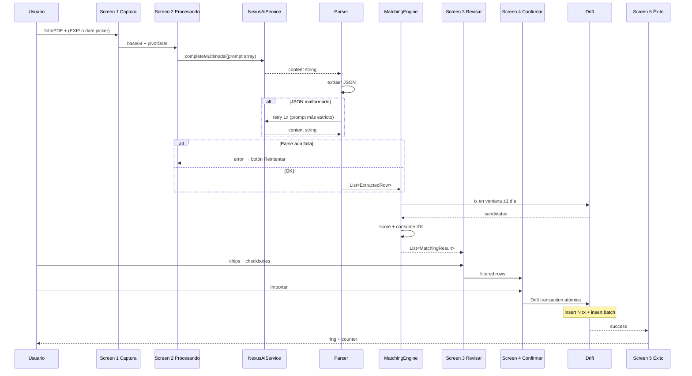
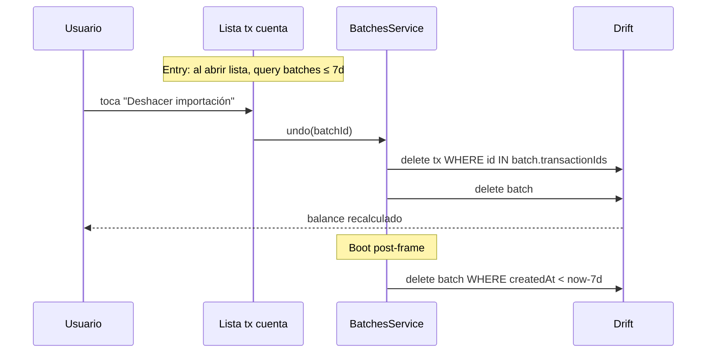

# Design: statement-reconciliation

## Technical Approach

Feature autocontenida bajo `lib/app/accounts/statement_import/` (UI) y `lib/core/services/statement_import/` (lógica). Reutiliza `NexusAiService.completeMultimodal` para vision directa, `ReceiptImageService` para resize/compress, y `Account.trackedSince` para el modo informativas. Tabla nueva `statement_import_batches` para trazabilidad y undo 7 días. El mockup `ejemplo/Nitido Statement Import.html` es la fuente visual de verdad — 5 pantallas, modos chips AND. Sin cambios en core de balance ni en NexusAI Gateway (`AI_infi`).

---

## Architecture Decisions

| # | Choice | Alternatives | Rationale |
|---|---|---|---|
| 1 | Nexus AI multimodal vision directa | ML Kit + Nexus text / híbrido toggle | Preserva señal visual (iconos ◄►, color verde/blanco BDV) que ML Kit pierde. Reusa patrón existente de receipt_ocr. |
| 2 | Chips combinables AND | Radios exclusivos | Permite "Faltantes + Comisiones" en un solo flujo. Decisión explícita del mockup (Variante B recomendada). |
| 3 | Matching simple (fecha+monto+signo) | Levenshtein/keyword bag descripción | 95% de casos reales cubiertos sin libs nuevas. Fuzzy va a v2. |
| 4 | Tabla dedicada `statement_import_batches` | Extender `pending_imports` | Semántica distinta: esta rastrea inserts confirmados para undo, no propuestas pendientes. |
| 5 | Modo informativo reusa `Account.trackedSince` | Flag `excludeFromBalance` por tx | El change anterior ya lo resolvió. Cero lógica adicional en core. |
| 6 | Package PDF: **`pdfx: ^2.9.0`** | `printing`, `native_pdf_renderer`, `syncfusion` | API específica para rasterizar páginas a imagen (`page.render(width, height)`). Sin licencia comercial. Ligero. |
| 7 | Retry Nexus si JSON malformado: **1 retry con prompt estricto** | Sin retry / reintentos indefinidos | Parser tolera markdown/prosa; solo reintenta si fracasa el parse. Segundo prompt añade "Devuelve SOLO el JSON, sin texto ni markdown". Si falla → error con botón Reintentar manual. |
| 8 | Informativas sin trackedSince: **diálogo con 2 CTAs** | Solo "Configurar ahora" (saca del flow) / auto-setear silenciosamente | Opciones: "Configurar ahora" (lleva al form) o "Activar desde hoy" (auto-setea `trackedSince = DateTime.now()` con confirm inline). Balance entre fricción y claridad. |
| 9 | Purga batches 7 días: **async post-frame** | Síncrono en boot | `WidgetsBinding.instance.addPostFrameCallback` ejecuta tras primer frame. No bloquea boot. |

---

## Data Flow — End-to-end



## Data Flow — Undo 7 días + auto-purge



---

## File Changes

| Archivo | Acción | Descripción |
|---|---|---|
| `assets/sql/migrations/v25.sql` | Crear | `CREATE TABLE statement_import_batches` + índices |
| `lib/core/database/sql/initial/tables.drift` | Modificar | Añadir definición tabla (mirror de v25) |
| `lib/core/database/app_db.dart` | Modificar | `schemaVersion => 25` |
| `lib/core/services/statement_import/statement_extractor_service.dart` | Crear | Orquesta Nexus + parser + retry |
| `lib/core/services/statement_import/matching_engine.dart` | Crear | Scoring + consume-IDs |
| `lib/core/services/statement_import/pdf_to_image_service.dart` | Crear | pdfx para rasterizar página 1 |
| `lib/core/services/statement_import/statement_batches_service.dart` | Crear | Commit atómico + undo + purge |
| `lib/core/services/statement_import/models/extracted_row.dart` | Crear | Freezed model |
| `lib/core/services/statement_import/models/matching_result.dart` | Crear | Freezed model |
| `lib/core/services/statement_import/models/import_batch.dart` | Crear | Freezed model |
| `lib/app/accounts/statement_import/statement_import_flow.dart` | Crear | Navigator 5 screens |
| `lib/app/accounts/statement_import/screens/{capture,processing,review,confirm,success}.page.dart` | Crear | 5 screens del mockup |
| `lib/app/accounts/statement_import/widgets/{mode_chips,row_tile,counter,si_header}.dart` | Crear | Widgets extraídos del JSX |
| `lib/app/accounts/details/account_details.dart` | Modificar | Botón "Importar estado de cuenta" |
| `lib/i18n/json/{es,en}.json` | Modificar | Rama `STATEMENT_IMPORT.*` |
| `pubspec.yaml` | Modificar | + `pdfx: ^2.9.0`, `exif: ^3.3.0` |

---

## Interfaces / Contracts

### Prompt Nexus AI (borrador)

**systemPrompt:**
```
Eres un extractor de movimientos bancarios venezolanos (BDV principalmente).
Tu ÚNICA salida es un JSON válido. Sin markdown, sin texto alrededor.
Schema:
{
  "transactions": [
    {
      "amount": number,       // SIEMPRE positivo
      "kind": "income" | "expense" | "fee",
      "date_hint": "HOY" | "AYER" | "YYYY-MM-DD",
      "time_hint": "HH:MM AM" | "HH:MM PM" | null,
      "description": string,
      "confidence": number
    }
  ]
}
Reglas:
- kind="fee" si descripción contiene "comisión", "cobro comisión", "cargo".
- kind="income" si icono es ► (derecha) y/o color verde.
- kind="expense" en otros casos con signo negativo.
- Devuelve un array vacío si no detectas movimientos.
```

**userPrompt (primer intento):** `"Extrae los movimientos de este estado de cuenta."`

**userPrompt (retry si JSON malformado):** `"Tu respuesta anterior no fue JSON válido. Devuelve SOLO el JSON con el schema indicado. Sin texto, sin markdown, sin explicaciones."`

### Models (pseudocódigo de campos)

```
ExtractedRow { id, amount, kind, date, description, confidence }
MatchingResult { row: ExtractedRow, existsInApp: bool, isPreFresh: bool, matchedTransactionId: String? }
ImportBatch { id, accountId, createdAt, modes: List<String>, transactionIds: List<String> }
```

### MatchingEngine API

```
Future<List<MatchingResult>> matchRows({
  required String accountId,
  required List<ExtractedRow> rows,
  required DateTime? trackedSince,
});
```

Internamente: query tx en ventana ±1 día, ordena por fecha, para cada row calcula score contra cada tx no-consumida, si score≥0.8 marca consumida y `existsInApp=true`. Añade flag `isPreFresh` usando `trackedSince`.

### SQL exacto

```sql
CREATE TABLE statement_import_batches (
  id           TEXT PRIMARY KEY,
  accountId    TEXT NOT NULL REFERENCES accounts(id) ON DELETE CASCADE,
  createdAt    DATETIME NOT NULL,
  mode         TEXT NOT NULL,          -- JSON array de modes activos
  transactionIds TEXT NOT NULL         -- JSON array de tx IDs
);
CREATE INDEX idx_sib_account ON statement_import_batches(accountId);
CREATE INDEX idx_sib_created ON statement_import_batches(createdAt);
```

---

## Testing Strategy

| Capa | Qué testear | Enfoque |
|---|---|---|
| Unit | MatchingEngine scoring + consume-IDs | Fixtures in-memory |
| Unit | Parser JSON tolerante (markdown, prosa) | Ejemplos de respuestas reales |
| Unit | BatchesService commit atómico + purge | Drift in-memory |
| Widget | ModeChips AND semantics | testWidgets con 2 chips activos |
| Integration | Migration v25 aplica limpio | DB v24 → v25 → query tabla nueva |
| Manual | Smoke con screenshot BDV real | Fase 6 única — NO `flutter test` en tandas intermedias |

---

## Migration / Rollout

1. Apply `v25.sql` → schemaVersion 24→25 → `dart run build_runner build`.
2. Añadir `pdfx` + `exif` en pubspec → `flutter pub get`.
3. Implementar por fases (ver `tasks.md`).
4. Smoke test manual en MIUI con BDV real.

**Rollback**: dropear `statement_import_batches` vía v26.sql (o dejar huérfana), revertir commits de UI + services + pubspec. Ninguna tx existente se altera.

## Open Questions

Todas resueltas en decisiones 6-9. Ninguna bloqueante para `sdd-tasks`.
