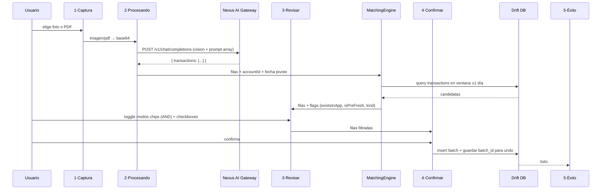

## Exploration: statement-reconciliation

### Contexto

Ramses necesita cuadrar Nitido con el estado real de sus cuentas bancarias (BDV, Mercantil, Provincial, Banesco). Hoy tiene movimientos faltantes — especialmente comisiones — y el balance no coincide. La solución: **importar estado de cuenta desde foto o PDF**, con un selector de modos que filtra QUÉ se importa (faltantes, solo ingresos, solo gastos, solo comisiones, informativas-sin-afectar-balance).

**Framing único**: este change es **un solo feature** con 5 modos combinables, no 3 changes separados. Los modos son filtros sobre la misma extracción OCR+AI.

**Diseño visual ya definido**: mockup en [ejemplo/Nitido Statement Import.html](../../ejemplo/Nitido%20Statement%20Import.html) con 5 pantallas, React/JSX, tema dark Nunito #C8B560 (accent dorado), decisión cerrada **chips combinables (no radios)**.

**Complementariedad con `account-pre-tracking-period`**: el modo `informative` **reusa** `Account.trackedSince` existente (inserta con fecha < trackedSince → auto pre-tracking → no afecta balance).

---

### Flujo objetivo (5 pantallas)

---

### Current State

#### Infraestructura ya reutilizable
- `lib/core/services/ai/nexus_ai_service.dart` — cliente HTTP a `https://api.ramsesdb.tech/v1/chat/completions` (Bearer auth), método `completeMultimodal(systemPrompt, userPrompt, imageBase64)`. Agnóstico al schema de respuesta → sirve para arrays sin cambios.
- `lib/core/services/receipt_ocr/receipt_image_service.dart` — resize 1600px + JPEG Q82, temp storage. Reusable tal cual.
- `lib/core/services/receipt_ocr/receipt_extractor_service.dart` — patrón de parseo JSON tolerante (tolera markdown/prosa en respuestas AI). Extraer a helper genérico.
- `Account.trackedSince` (del change anterior) — la feature `informative` encaja directo sin lógica adicional.
- `NitidoSnackbar.warning`, `InlineInfoCard`, `AlertDialog` → patrones UI ya usados.

#### Nexus AI Gateway
- Ubicación: `c:\Users\ramse\OneDrive\Documents\vacas\AI_infi` (repo propio, TypeScript/Bun).
- Modelo default: `openai/gpt-4.1-mini` con fallbacks Groq/OpenRouter/Cerebras.
- Circuit breaker 3 fallos → OPEN 60s. Exponential backoff 100-2000ms.
- **Cero cambios necesarios** en el backend — es agnóstico al schema de respuesta.

#### Tabla `transactions`
- Schema en `lib/core/database/sql/initial/tables.drift:129-219`.
- Campos: `id, date, accountID, value, type (E/I/T), receivingAccountID, valueInDestiny, categoryID, notes`.
- **Sin campo `bankRef`** → dedup cross-pipeline queda por fecha+monto+signo. Aceptado v1.

#### Mockup React — 5 pantallas
Archivo `ejemplo/Nitido Statement Import.html` + atoms/screens JSX. Decisiones visuales cerradas:
- Tema dark #0a0a0a, accent #C8B560.
- Android frame 360×780, Nunito.
- Screen 1: hero doc animado + 2 CTAs (Tomar foto / Subir PDF o imagen).
- Screen 2: scan line + contador "{N} encontrados" + skeleton rows + botón cancelar.
- Screen 3: **AccountTile** + **ModeChips** + **Counter** prominente + warning inline + lista Rows con tags (Ya existe / Pre-Fresh / Comisión) + botón "Todos/Ninguno" en header + CTA "Continuar · N movimientos".
- Screen 4: contador grande + chip "Historial · no afecta balance" si informativas + card Desglose (Ingresos/Gastos/Comisiones) + helper undo 7 días + botones Volver/Importar.
- Screen 5: animación check ring + contador grande + CTAs "Ver en historial" / "Listo".

#### Modos (definidos en `ejemplo/si-data.jsx`)

| id | label | predicate | Notas |
|---|---|---|---|
| `missing` | Solo faltantes | `!existsInApp` | Requiere matching contra DB |
| `income` | Solo ingresos | `amount > 0` | |
| `expense` | Solo gastos | `amount < 0 && kind !== 'fee'` | **Gastos excluye comisiones** |
| `fees` | Solo comisiones | `kind === 'fee'` | Detectado por keyword "comisión" |
| `informative` | Informativas | `date < trackedSince` | Usa Fresh Start |

Semántica: **AND de los chips activos** (ejemplo: `missing + fees` = solo las comisiones que te faltan).

---

### Affected Areas

#### Archivos nuevos
- `lib/app/accounts/statement_import/statement_import_flow.dart` — navegador principal (5 screens con state).
- `lib/app/accounts/statement_import/screens/capture.page.dart` — Screen 1.
- `lib/app/accounts/statement_import/screens/processing.page.dart` — Screen 2.
- `lib/app/accounts/statement_import/screens/review.page.dart` — Screen 3.
- `lib/app/accounts/statement_import/screens/confirm.page.dart` — Screen 4.
- `lib/app/accounts/statement_import/screens/success.page.dart` — Screen 5.
- `lib/app/accounts/statement_import/widgets/mode_chips.dart` — widget del selector.
- `lib/app/accounts/statement_import/widgets/row_tile.dart` — fila con tags.
- `lib/app/accounts/statement_import/widgets/counter.dart` — contador prominente.
- `lib/core/services/statement_import/statement_extractor_service.dart` — orquesta Nexus AI call (prompt array).
- `lib/core/services/statement_import/matching_engine.dart` — scoring fecha+monto+signo + flags `existsInApp` `isPreFresh` `kind`.
- `lib/core/services/statement_import/models/extracted_row.dart` + `matching_result.dart` + `import_batch.dart`.
- `lib/core/services/statement_import/pdf_to_image_service.dart` — rasteriza PDF a imágenes.
- `assets/sql/migrations/v25.sql` — tabla `statement_import_batches` para undo.

#### Archivos modificados
- `lib/core/database/sql/initial/tables.drift` — añadir tabla `statement_import_batches(id, accountId, createdAt, mode, transactionIds TEXT)` + schemaVersion 24→25.
- `lib/i18n/json/es.json` + `en.json` — nueva rama `STATEMENT_IMPORT.*` (headers, modos, tags, banners, CTAs).
- `lib/app/accounts/details/account_details.dart` — botón "Importar estado de cuenta" en menú de la cuenta.
- `pubspec.yaml` — añadir `printing` o `native_pdf_renderer` para rasterizar PDFs, `exif` para fecha pivote automática.

#### Sin tocar
- `NexusAiService` — reutilizar `completeMultimodal` tal cual.
- `ReceiptImageService` — reutilizar para resize/compress.
- Backend Nexus AI — cero cambios.
- `Account.trackedSince` — el modo informativas lo aprovecha sin lógica nueva.

---

### Approaches

#### 1. Nexus AI multimodal como extractor principal (ELEGIDO — Camino B del usuario)

Imagen o PDF (rasterizado a imagen) → base64 → Nexus AI → JSON array de filas.

- **Pros**:
  - Multi-banco sin mantener regex profiles por banco.
  - Un solo pipeline.
  - Reutiliza infraestructura existente (`NexusAiService`, `ReceiptImageService`).
  - Modelo multimodal maneja variaciones visuales (dark mode, crops, columnas).
- **Cons**:
  - Consume créditos Nexus por cada import.
  - Latencia ~2-5s por imagen.
  - Contradice el tag "OCR EN DISPOSITIVO" del mockup → hay que reformular a "Privado · tu infraestructura" o similar.
- **Esfuerzo**: Medio.

#### 2. Google ML Kit on-device (tag "OCR EN DISPOSITIVO" literal)

ML Kit extrae texto plano → parser regex on-device por banco → JSON array.

- **Pros**: privacidad total, gratis, offline.
- **Cons**:
  - Requiere mantener regex profiles por banco (4-6 bancos VE en roadmap).
  - Frágil a cambios de UI de la app del banco.
  - Mucho más código para manejar variaciones.
- **Esfuerzo**: Alto.

#### 3. Híbrido ML Kit local primero, Nexus fallback

- **Pros**: privacidad por default + robustez.
- **Cons**: duplica complejidad, rara vez vale la pena si Nexus es propio.
- **Esfuerzo**: Alto.

**Decisión del usuario: Approach 1 (Nexus central)**. "Nexus es muy importante también" → queda como extractor principal, sin fallback ML Kit. El tag "OCR EN DISPOSITIVO" del mockup se reformula a **"IA privada · tu infraestructura"** o **"Nexus · cifrado en tránsito"** (honesto con el usuario sobre lo que pasa).

---

### Recommendation

**MVP v1 (aprobado):**
1. Flujo de 5 pantallas del mockup.
2. Input: foto (cámara o galería) o PDF (single-page, rasterizado a imagen).
3. Pipeline: imagen → resize → base64 → Nexus AI con prompt array → JSON → matching → UI.
4. Matching simple: fecha mismo día + monto exacto + signo → `existsInApp=true`. Sin fuzzy descripción.
5. 5 modos combinables (AND) como chips.
6. Tag "Ya existe" (dedup) / "Pre-Fresh" (date < trackedSince) / "Comisión" (kind=fee) por row.
7. Banner warning inline: modo informativas + filas post-trackedSince.
8. Undo 7 días vía tabla `statement_import_batches`.
9. Multi-banco VE: BDV default, pero prompt genérico funciona para Mercantil/Provincial/Banesco.
10. i18n es+en (resto fallback EN).

**Out of scope v1 (v2 o changes separados):**
- Multi-página PDF (solo página 1 en v1).
- Multi-imagen batch (un screenshot a la vez).
- Auto-categorización de comisiones (change separado `bank-fees-autocategorization`).
- Fuzzy matching de descripción.
- Campo `bankRef` en transactions (para dedup cross-pipeline con auto_import SMS/notif).
- Soporte bancos fuera de Venezuela.

**Fases estimadas (6, similar al change anterior):**

| Fase | Contenido |
|---|---|
| 1 | Infra DB: tabla `statement_import_batches`, migration v25, modelos `ExtractedRow`/`MatchingResult`/`ImportBatch` |
| 2 | Core: `StatementExtractorService` (prompt Nexus + parser JSON), `MatchingEngine` (scoring + flags), `PdfToImageService` |
| 3 | UI screens 1-2 (Captura + Procesando) |
| 4 | UI screens 3-4-5 (Revisar + Confirmar + Éxito) + ModeChips + RowTile + Counter + banner warning |
| 5 | i18n es+en (STATEMENT_IMPORT.*), entry point desde account_details, undo 7 días |
| 6 | Smoke test manual MIUI con screenshots reales de BDV |

---

### Decisiones clave cerradas

- **Extractor**: Nexus AI multimodal (Approach 1).
- **Modos**: chips combinables AND (variante B del mockup), 5 modos predefinidos.
- **Matching**: simple — fecha mismo día + monto exacto + signo. Sin fuzzy descripción en v1.
- **Ventana temporal matching**: ±1 día.
- **Fecha pivote**: EXIF automático (añadir `exif` package) + campo editable fallback.
- **PDF**: rasterizar página 1 a imagen. Multi-página en v2.
- **Undo**: tabla `statement_import_batches` guarda IDs de tx creadas. Cron local borra batches >7 días.
- **Modo informativas**: inserta tx con fecha < `account.trackedSince` → pre-tracking natural. Si la cuenta no tiene trackedSince configurado, mostrar diálogo "Activa Fresh Start primero" (linkea al form de cuenta).
- **Double-match**: MatchingEngine consume IDs (set de ya-usados) para evitar que una tx real matchee con 2 filas OCR.

---

### Risks

1. **Nexus AI falla o rate-limit** → circuit breaker del gateway ya devuelve error. Mostrar "no pudimos leer la imagen, reintenta" + botón Reintentar. No hay fallback local.

2. **PDF multi-página silenciosamente cortado** → warning visible en Screen 1 si el PDF tiene >1 página: "Solo procesaremos la página 1 en v1". Decisión consciente.

3. **Tag del mockup "OCR EN DISPOSITIVO" es incorrecto con Approach 1** → reformular copy a "IA privada · tu infraestructura" o similar. Honesto con el usuario.

4. **Doble match** (dos gastos iguales mismo día, solo uno registrado en app) → MatchingEngine consume IDs usados.

5. **Transacción borrada intencionalmente por el usuario reaparece en el OCR** → en v1 se acepta: el usuario verá el tag "Ya existe" solo si aún está en app; si la borró, aparece sin tag y tendrá que desmarcarla manualmente. v2 puede agregar `dismissed_hashes`.

6. **Informativas con `trackedSince = NULL`** → usuario sin Fresh Start activo. Mostrar diálogo obligatorio para configurarlo antes de continuar.

7. **Bancos no-VE** → prompt genérico debería funcionar, pero validar con 1 screenshot real de cada banco en v2 antes de publicitar soporte multi-banco.

8. **Latencia Nexus ~2-5s** → Screen 2 con progreso + animación ocupa ese tiempo. Timeout 30s. Si se cancela, matar request.

9. **Costo acumulado Nexus** → 1 request multimodal por import. Ramses usa activamente → ~3-5 por semana → dentro del plan actual.

---

### Ready for Proposal

**Sí.** El mockup cierra el 90% de decisiones visuales y de UX. Lo que queda abierto y debe resolverse en `sdd-propose`:

1. **Copy del tag on-device**: qué frase reemplaza "OCR EN DISPOSITIVO" ahora que es Nexus. Propuesta: "Procesamiento con IA · tu infraestructura".
2. **Ubicación del botón de entrada**: ¿en detalle de cuenta, en menú general, o ambos? Mockup no lo muestra.
3. **Qué hacer si la cuenta no tiene `trackedSince` y elige modo informativo**: diálogo obligatorio vs disable chip vs auto-activar. Propuesta: diálogo "Configura Fresh Start primero" con botón directo al form.
4. **Package PDF**: `printing` vs `native_pdf_renderer` vs `syncfusion_flutter_pdf`. Elegir basado en tamaño + mantenimiento activo.

Siguiente paso: `sdd-propose` con todo lo anterior consolidado.
